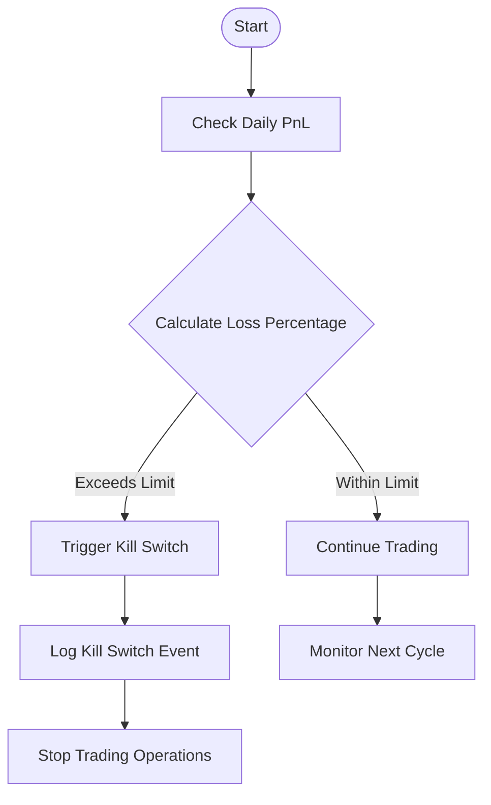
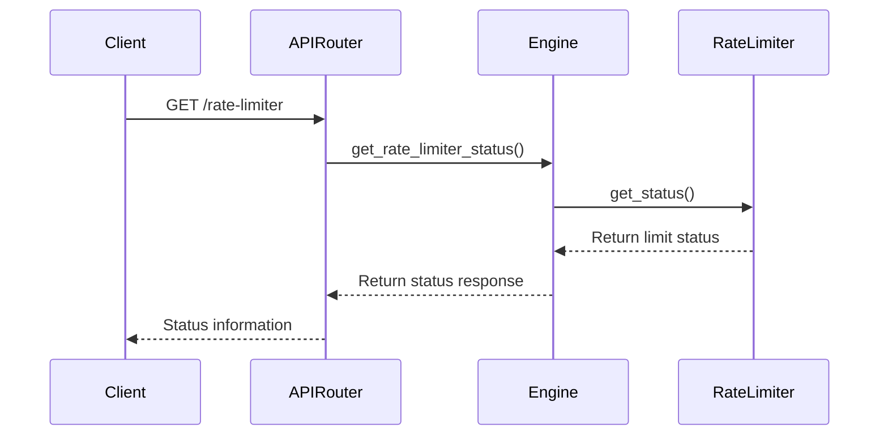

# Troubleshooting Guide

<cite>
**Referenced Files in This Document**   
- [FINAL_TRADE_TESTING_REPORT.md](file://FINAL_TRADE_TESTING_REPORT.md)
- [CONCRETE_FIX_PLAN.md](file://CONCRETE_FIX_PLAN.md)
- [TRADING_LOGIC_ANALYSIS_REPORT.md](file://TRADING_LOGIC_ANALYSIS_REPORT.md)
- [debug_engine.py](file://debug_engine.py)
- [debug_signal_generation.py](file://debug_signal_generation.py)
- [debug_kill_switch.py](file://debug_kill_switch.py)
- [enhanced_logger.py](file://breakout_bot/utils/enhanced_logger.py)
</cite>

## Table of Contents
1. [Introduction](#introduction)
2. [Startup Failures](#startup-failures)
3. [Trading Anomalies](#trading-anomalies)
4. [Performance Degradation](#performance-degradation)
5. [Configuration Errors](#configuration-errors)
6. [Debugging Tools](#debugging-tools)
7. [Log Interpretation](#log-interpretation)
8. [Diagnostic Checklists](#diagnostic-checklists)
9. [Subtle System Issues](#subtle-system-issues)
10. [Escalation Procedures](#escalation-procedures)

## Introduction
This troubleshooting guide addresses common issues encountered during the operation and development of the Breakout Bot trading system. The document is organized by issue categories with detailed symptom descriptions, root cause analysis based on diagnostic reports, and step-by-step resolution procedures. It incorporates findings from FINAL_TRADE_TESTING_REPORT.md, known fixes from CONCRETE_FIX_PLAN.md, and successful remediation examples from TRADING_LOGIC_ANALYSIS_REPORT.md.

## Startup Failures

### Engine Initialization Failure
**Symptom**: The engine fails to start with dependency import errors or configuration loading failures.
**Root Cause**: Missing dependencies, incorrect Python path, or corrupted configuration files as identified in debug_engine.py diagnostics.
**Resolution**:
1. Run `python debug_engine.py` to diagnose startup issues
2. Verify all dependencies are installed via `pip install -r requirements.txt`
3. Confirm the project path is correctly added to sys.path
4. Validate configuration files exist in breakout_bot/config/ directory
5. Test individual component imports using test_individual_components()

**Section sources**
- [debug_engine.py](file://debug_engine.py#L0-L178)
- [engine.py](file://breakout_bot/core/engine.py#L0-L1150)

### State Machine Not Transitioning
**Symptom**: Engine starts but remains in INITIALIZING state without transitioning to SCANNING.
**Root Cause**: Failed initialization of critical components like ExchangeClient or MarketDataProvider.
**Resolution**:
1. Check enhanced_logger output for component initialization errors
2. Verify exchange API credentials in settings
3. Test connectivity to exchange endpoints using check_api_endpoints.py
4. Ensure network connectivity and firewall rules allow outbound connections

**Section sources**
- [engine.py](file://breakout_bot/core/engine.py#L0-L1150)
- [state_machine.py](file://breakout_bot/core/state_machine.py)

## Trading Anomalies

### No Signal Generation
**Symptom**: Scanning completes successfully but no signals are generated despite promising candidates.
**Root Cause**: Overly strict filter thresholds preventing any candidate from passing all filters, as documented in FINAL_TRADE_TESTING_REPORT.md.
**Resolution**:
1. Use `python debug_signal_generation.py` to analyze signal generation
2. Review filter results for failed conditions (max_spread, volume_surge, etc.)
3. Adjust filter thresholds in preset configuration:
   ```json
   {
     "liquidity_filters": {
       "max_spread_bps": 5.0,
       "min_depth_usd_0_5pct": 50000
     },
     "volatility_filters": {
       "volume_surge_1h_min": 1.1,
       "volume_surge_5m_min": 1.3
     }
   }
   ```
4. Consider implementing a symbol whitelist for high-quality tokens

**Section sources**
- [FINAL_TRADE_TESTING_REPORT.md](file://FINAL_TRADE_TESTING_REPORT.md#L0-L127)
- [debug_signal_generation.py](file://debug_signal_generation.py#L0-L118)
- [market_scanner.py](file://breakout_bot/scanner/market_scanner.py)

### Kill Switch Triggering Prematurely
**Symptom**: Trading stops unexpectedly due to kill switch activation despite acceptable performance.
**Root Cause**: Incorrect daily PnL calculation or overly sensitive loss thresholds.
**Resolution**:
1. Debug kill switch logic using `python debug_kill_switch.py`
2. Verify account equity tracking and PnL calculations
3. Adjust kill_switch_loss_limit in risk configuration
4. Ensure proper timestamp handling for daily reset



**Diagram sources**
- [debug_kill_switch.py](file://debug_kill_switch.py#L0-L89)
- [risk_manager.py](file://breakout_bot/risk/risk_manager.py)

**Section sources**
- [debug_kill_switch.py](file://debug_kill_switch.py#L0-L89)
- [CONCRETE_FIX_PLAN.md](file://CONCRETE_FIX_PLAN.md#L0-L431)

## Performance Degradation

### High Memory Usage
**Symptom**: System memory consumption increases over time leading to performance degradation.
**Root Cause**: Cache accumulation without proper cleanup in MarketScanner as identified in TRADING_LOGIC_ANALYSIS_REPORT.md.
**Resolution**:
1. Implement cache TTL and size limits
2. Add periodic cache cleanup: `_cleanup_cache()` every 5 minutes
3. Limit cache entries to 1000 maximum
4. Use LRU (Least Recently Used) eviction policy for oversized caches

**Section sources**
- [TRADING_LOGIC_ANALYSIS_REPORT.md](file://TRADING_LOGIC_ANALYSIS_REPORT.md#L0-L192)
- [optimized_scanner.py](file://breakout_bot/scanner/optimized_scanner.py)

### Slow State Transitions
**Symptom**: Delays between state transitions exceeding expected cycle times.
**Root Cause**: Lack of timeouts in state machine operations causing indefinite waits.
**Resolution**:
1. Implement state-specific timeouts:
   - SCANNING: 60 seconds
   - LEVEL_BUILDING: 30 seconds  
   - SIGNAL_WAIT: 30 seconds
   - SIZING: 10 seconds
   - EXECUTION: 60 seconds
2. Add watchdog monitoring for stuck states
3. Configure automatic transition to ERROR state on timeout

**Section sources**
- [CONCRETE_FIX_PLAN.md](file://CONCRETE_FIX_PLAN.md#L0-L431)
- [engine.py](file://breakout_bot/core/engine.py#L0-L1150)

## Configuration Errors

### Invalid Preset Loading
**Symptom**: System fails to load trading presets with JSON parsing or validation errors.
**Root Cause**: Malformed JSON syntax or missing required fields in preset files.
**Resolution**:
1. Validate JSON syntax using standard JSON validators
2. Verify all required fields exist in the preset structure
3. Compare against working preset (breakout_v1_working.json)
4. Use compare_presets.py to identify structural differences

**Section sources**
- [settings.py](file://breakout_bot/config/settings.py)
- [breakout_v1_working.json](file://breakout_bot/config/presets/breakout_v1_working.json)

### Rate Limiter Conflicts
**Symptom**: Exchange API requests being rejected due to rate limiting despite configured limits.
**Root Cause**: Inconsistent rate limiter configuration between client and exchange requirements.
**Resolution**:
1. Check rate limiter status via API endpoint `/api/monitoring/rate-limiter`
2. Reset rate limiter state using `/api/monitoring/rate-limiter/reset`
3. Adjust category limits based on actual exchange requirements
4. Implement exponential backoff for IP-level limits



**Diagram sources**
- [rate_limiter.py](file://breakout_bot/exchange/rate_limiter.py)
- [monitoring.py](file://breakout_bot/api/routers/monitoring.py)

**Section sources**
- [rate_limiter.py](file://breakout_bot/exchange/rate_limiter.py)
- [monitoring.py](file://breakout_bot/api/routers/monitoring.py)

## Debugging Tools

### Engine Debugger
**Purpose**: Diagnose engine startup and component initialization issues.
**Usage**: `python debug_engine.py`
**Features**:
- Dependency verification
- Component import testing
- Engine initialization sequence debugging
- Comprehensive error reporting with stack traces

**Section sources**
- [debug_engine.py](file://debug_engine.py#L0-L178)

### Signal Generation Debugger
**Purpose**: Analyze why signals are not being generated from scan results.
**Usage**: `python debug_signal_generation.py`
**Features**:
- Real-time market data retrieval
- Filter result breakdown
- Signal condition evaluation
- Detailed failure diagnostics for non-generated signals

**Section sources**
- [debug_signal_generation.py](file://debug_signal_generation.py#L0-L118)

### Kill Switch Debugger
**Purpose**: Test kill switch logic and risk management thresholds.
**Usage**: `python debug_kill_switch.py`
**Features**:
- Risk limit evaluation
- Signal approval testing
- Portfolio risk assessment
- Kill switch trigger simulation

**Section sources**
- [debug_kill_switch.py](file://debug_kill_switch.py#L0-L89)

## Log Interpretation

### Enhanced Logger Structure
The enhanced_logger.py implements structured logging with context-aware entries containing:
- Timestamp in ISO format
- Log level (DEBUG, INFO, WARNING, ERROR, CRITICAL, PERFORMANCE, TRADE, RISK)
- Component identifier
- Structured context (session_id, user_id, request_id, etc.)
- Performance metrics
- Stack trace for errors

**Log Entry Example**:
```json
{
  "timestamp": "2025-09-22T23:38:38Z",
  "level": "ERROR",
  "message": "Connection error detected",
  "context": {
    "component": "exchange_client",
    "state": "CONNECTING",
    "error_code": "CONN_TIMEOUT"
  },
  "data": {
    "attempt": 3,
    "backoff_delay": 5.0
  },
  "stack_trace": "..."
}
```

### Performance Metrics Logging
PerformanceTracker decorator automatically logs execution metrics:
- Operation duration (ms)
- CPU utilization percentage
- Memory usage percentage
- Contextual operation name

**Section sources**
- [enhanced_logger.py](file://breakout_bot/utils/enhanced_logger.py#L0-L299)

## Diagnostic Checklists

### Exchange Connectivity Verification
- [ ] Test API endpoint reachability
- [ ] Verify authentication credentials
- [ ] Confirm network connectivity to exchange
- [ ] Check firewall rules for outbound traffic
- [ ] Validate SSL/TLS certificates
- [ ] Test WebSocket connection stability

### API Rate Limit Validation
- [ ] Monitor current request rates vs limits
- [ ] Verify rate limiter status endpoint
- [ ] Check for recent rate limit errors
- [ ] Validate backoff implementation
- [ ] Confirm limit reset timestamps
- [ ] Test burst request handling

### Preset Validity Checklist
- [ ] JSON syntax validation
- [ ] Required fields presence
- [ ] Numeric value ranges
- [ ] Filter threshold reasonableness
- [ ] Risk parameter consistency
- [ ] Correlation with working presets

**Section sources**
- [settings.py](file://breakout_bot/config/settings.py)
- [presets](file://breakout_bot/config/presets)

## Subtle System Issues

### Clock Drift Affecting Time-Based Filters
**Symptom**: Time-based filters (e.g., volume surge over 5 minutes) produce inconsistent results.
**Root Cause**: System clock drift causing timing discrepancies in candle aggregation.
**Resolution**:
1. Implement NTP synchronization
2. Use exchange server timestamps for critical calculations
3. Add clock drift compensation factor
4. Validate system time against multiple time servers

### Floating-Point Precision Errors
**Symptom**: Position calculations yielding unexpected values due to floating-point arithmetic.
**Root Cause**: Accumulated precision errors in financial calculations.
**Resolution**:
1. Use decimal arithmetic for monetary calculations
2. Implement safe math operations with error checking
3. Round intermediate results appropriately
4. Validate calculations with boundary conditions

**Section sources**
- [safe_math.py](file://breakout_bot/utils/safe_math.py)
- [position_manager.py](file://breakout_bot/position/position_manager.py)

## Escalation Procedures

### Unresolved Problem Protocol
When issues cannot be resolved through standard troubleshooting:
1. Collect comprehensive diagnostic information:
   - Last 1000 log entries
   - Memory snapshot (memory_snapshot_*.json)
   - Current system status
   - Active positions and signals
   - Recent error summaries

2. Package information into compressed archive:
   ```bash
   zip -r support_bundle_$(date +%Y%m%d_%H%M%S).zip \
   logs/*.log \
   memory_snapshot_*.json \
   diag_summary.md
   ```

3. Include the following information:
   - Problem description and impact
   - Steps to reproduce
   - Diagnostic tool outputs
   - Configuration details (excluding sensitive data)
   - Timeline of events

4. Contact support team with reference to:
   - FINAL_TRADE_TESTING_REPORT.md
   - TRADING_LOGIC_ANALYSIS_REPORT.md  
   - CONCRETE_FIX_PLAN.md

**Section sources**
- [FINAL_TRADE_TESTING_REPORT.md](file://FINAL_TRADE_TESTING_REPORT.md)
- [TRADING_LOGIC_ANALYSIS_REPORT.md](file://TRADING_LOGIC_ANALYSIS_REPORT.md)
- [CONCRETE_FIX_PLAN.md](file://CONCRETE_FIX_PLAN.md)