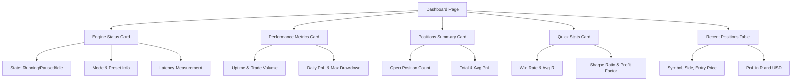
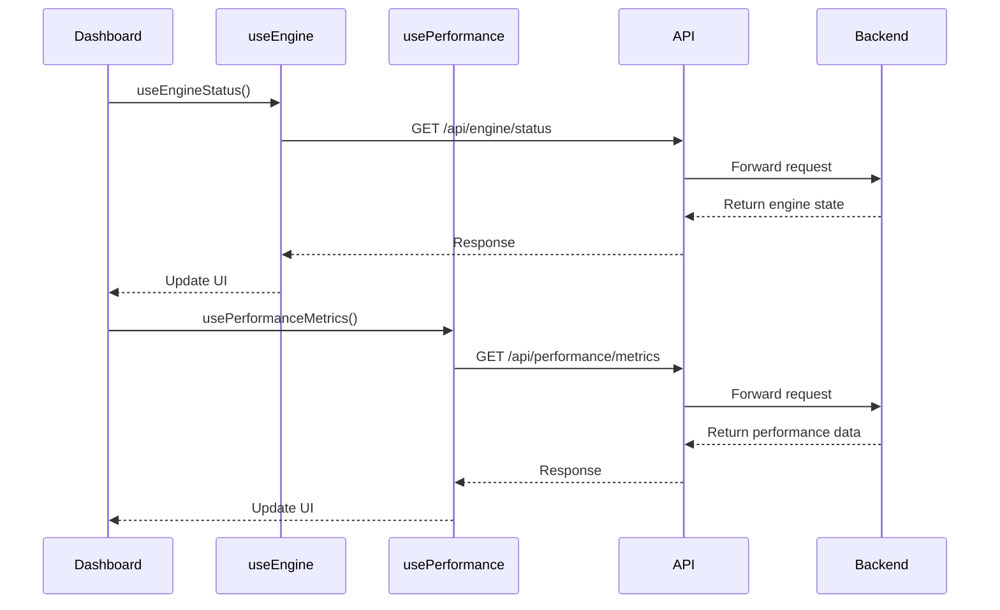
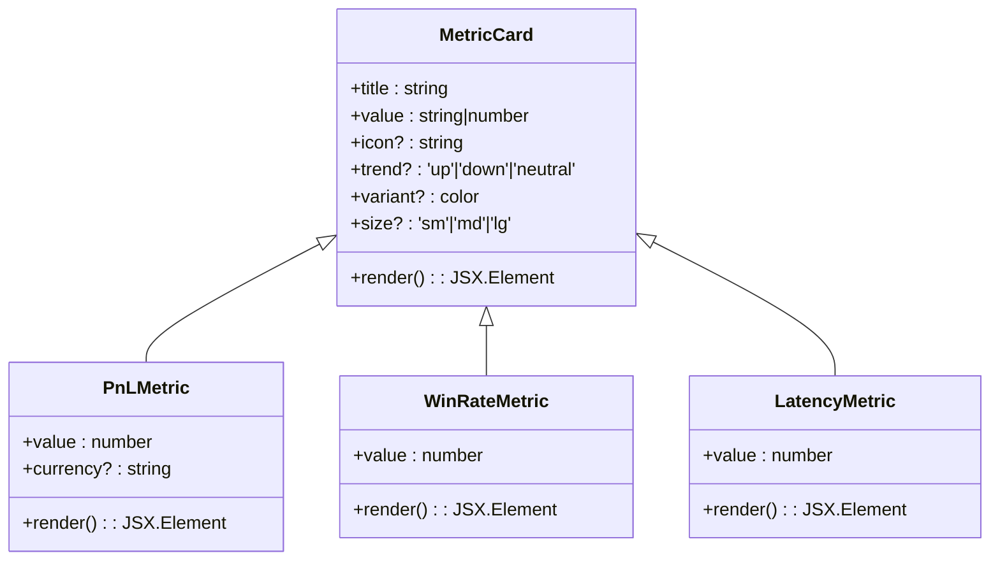

# Dashboard Overview

<cite>
**Referenced Files in This Document**   
- [Dashboard.tsx](file://frontend/src/pages/Dashboard.tsx)
- [useEngine.ts](file://frontend/src/hooks/useEngine.ts)
- [usePerformance.ts](file://frontend/src/hooks/usePerformance.ts)
- [MetricCard.tsx](file://frontend/src/components/ui/MetricCard.tsx)
- [metrics.py](file://breakout_bot/api/routers/metrics.py)
- [performance.py](file://breakout_bot/api/routers/performance.py)
- [endpoints.ts](file://frontend/src/api/endpoints.ts)
</cite>

## Table of Contents
1. [Introduction](#introduction)
2. [Layout and Key Components](#layout-and-key-components)
3. [Data Fetching and Caching Strategy](#data-fetching-and-caching-strategy)
4. [Metric Visualization with MetricCard](#metric-visualization-with-metriccard)
5. [Engine State Interpretation](#engine-state-interpretation)
6. [Responsiveness and Accessibility](#responsiveness-and-accessibility)
7. [Troubleshooting Common Issues](#troubleshooting-common-issues)
8. [Conclusion](#conclusion)

## Introduction
The Dashboard serves as the central monitoring interface for the trading system, providing real-time visibility into engine status, performance KPIs, position summaries, and recent trading activity. It is designed to deliver actionable insights at a glance while supporting deeper analysis through interactive components. The page integrates multiple data sources via React Query hooks and presents them using dynamically styled UI components that reflect current system health and trading outcomes.

**Section sources**
- [Dashboard.tsx](file://frontend/src/pages/Dashboard.tsx#L1-L230)

## Layout and Key Components
The Dashboard is organized into a responsive grid layout with four primary metric cards followed by a table of recent positions. Each card displays critical information:

- **Engine Status**: Current state (running, paused, idle), mode, active preset, and latency
- **Performance Metrics**: Uptime, total trades, daily PnL (R), and maximum drawdown
- **Positions Summary**: Open position count, total PnL in USD, and average PnL in R
- **Quick Stats**: Win rate, average R, Sharpe ratio, and profit factor

Below these cards, the "Recent Positions" section lists up to five open positions with symbol, side, entry price, and PnL metrics.



**Diagram sources**
- [Dashboard.tsx](file://frontend/src/pages/Dashboard.tsx#L1-L230)

**Section sources**
- [Dashboard.tsx](file://frontend/src/pages/Dashboard.tsx#L1-L230)

## Data Fetching and Caching Strategy
The Dashboard leverages React Query through custom hooks (`useEngineStatus`, `useEngineMetrics`, `usePerformanceMetrics`) to fetch data efficiently. These hooks provide automatic caching, background refetching, and stale data handling.

Each hook defines specific query keys and refresh intervals:
- `useEngineStatus`: Refetches every 5 seconds, stale after 3 seconds
- `useEngineMetrics`: Refetches every 10 seconds, stale after 5 seconds
- `usePerformanceMetrics`: Refetches every 30 seconds, stale after 15 seconds

These endpoints connect to backend APIs defined in `endpoints.ts`, which route requests to corresponding FastAPI endpoints in `metrics.py` and `performance.py`.



**Diagram sources**
- [useEngine.ts](file://frontend/src/hooks/useEngine.ts#L1-L93)
- [usePerformance.ts](file://frontend/src/hooks/usePerformance.ts#L1-L45)
- [endpoints.ts](file://frontend/src/api/endpoints.ts#L1-L153)

**Section sources**
- [useEngine.ts](file://frontend/src/hooks/useEngine.ts#L1-L93)
- [usePerformance.ts](file://frontend/src/hooks/usePerformance.ts#L1-L45)

## Metric Visualization with MetricCard
The `MetricCard` component standardizes the display of key metrics with dynamic formatting and state-based coloring. It supports various props including title, value, icon, trend direction, color variant, and size.

Specialized variants include:
- `PnLMetric`: Colors green for positive PnL, red for negative, uses currency-specific icons
- `WinRateMetric`: Uses tiered thresholds (≥70% excellent, ≥50% good) to determine icon and color
- `LatencyMetric`: Evaluates latency values (<50ms excellent, <100ms good) for visual feedback

These components ensure consistent presentation across the dashboard while conveying qualitative assessments through visual cues.



**Diagram sources**
- [MetricCard.tsx](file://frontend/src/components/ui/MetricCard.tsx#L1-L149)

**Section sources**
- [MetricCard.tsx](file://frontend/src/components/ui/MetricCard.tsx#L1-L149)

## Engine State Interpretation
The dashboard provides distinct visual feedback based on engine state:

- **Running**: Green badge, low latency icon (⚡ or 🚀), active metrics updating in real time
- **Paused**: Yellow badge, moderate latency indication, metrics frozen but visible
- **Idle**: Gray badge, no active trading data, placeholder values displayed

Users can interpret performance during different states:
- During **running** state, focus on trade frequency, win rate trends, and drawdown control
- In **paused** state, review open positions and recent PnL without new entries
- When **idle**, verify configuration and preset selection before activation

This contextual awareness helps operators make informed decisions about system operation.

**Section sources**
- [Dashboard.tsx](file://frontend/src/pages/Dashboard.tsx#L1-L230)
- [useEngine.ts](file://frontend/src/hooks/useEngine.ts#L1-L93)

## Responsiveness and Accessibility
The Dashboard employs a mobile-first responsive design using Bootstrap's grid system (`Row`, `Col`). On smaller screens, metric cards stack vertically to maintain readability. All interactive elements support keyboard navigation, and screen reader accessibility is ensured through proper ARIA labels and semantic HTML structure.

Loading states are clearly indicated with spinners within each card, and empty states (e.g., no open positions) are handled gracefully with dedicated components like `EmptyPositions`. Dynamic text truncation prevents overflow issues in constrained spaces.

**Section sources**
- [Dashboard.tsx](file://frontend/src/pages/Dashboard.tsx#L1-L230)
- [MetricCard.tsx](file://frontend/src/components/ui/MetricCard.tsx#L1-L149)

## Troubleshooting Common Issues
### Missing Metrics
If metrics fail to load:
1. Verify backend service availability via `/api/health`
2. Check WebSocket connection status in browser developer tools
3. Manually trigger cache invalidation using developer console:
```javascript
queryClient.invalidateQueries({ queryKey: ['engine'] })
```

### Stale Displays
When data appears outdated:
- Confirm network requests are being made every refetch interval
- Check for JavaScript errors preventing React Query from functioning
- Restart the engine to reset internal state if necessary

### WebSocket Reconnection
The frontend automatically attempts WebSocket reconnection every 5 seconds if disconnected. Users should see transient "connecting" indicators during recovery. Persistent failures require checking server logs and network connectivity.

**Section sources**
- [useEngine.ts](file://frontend/src/hooks/useEngine.ts#L1-L93)
- [usePerformance.ts](file://frontend/src/hooks/usePerformance.ts#L1-L45)
- [endpoints.ts](file://frontend/src/api/endpoints.ts#L1-L153)

## Conclusion
The Dashboard provides a comprehensive, real-time view of trading system performance through well-structured visualizations and efficient data fetching mechanisms. By leveraging React Query for state management and custom metric components for consistent presentation, it delivers both high-level overviews and detailed insights. Its responsive design and accessibility features ensure usability across devices and user needs, while robust error handling and troubleshooting guidance support reliable operation in production environments.