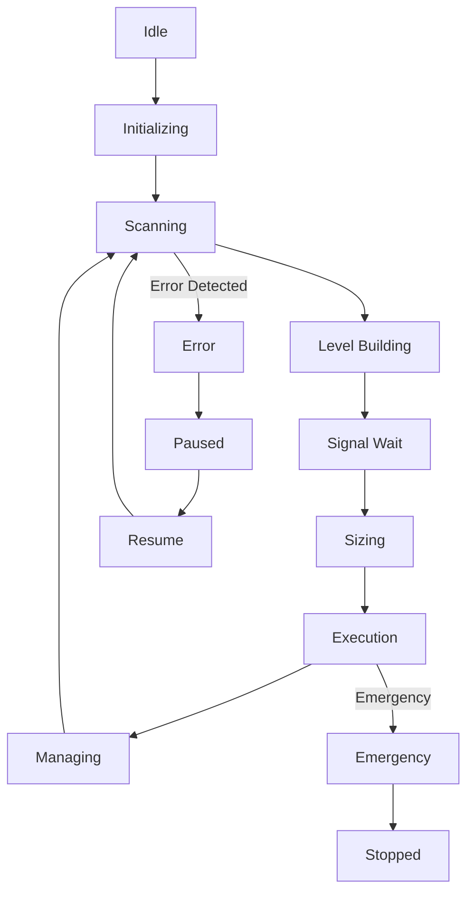
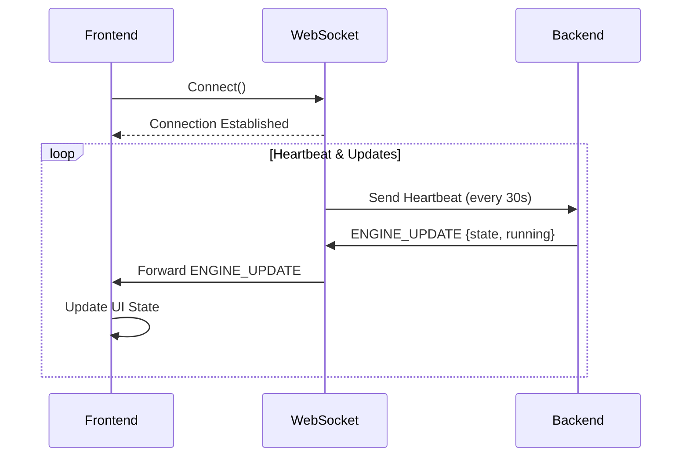
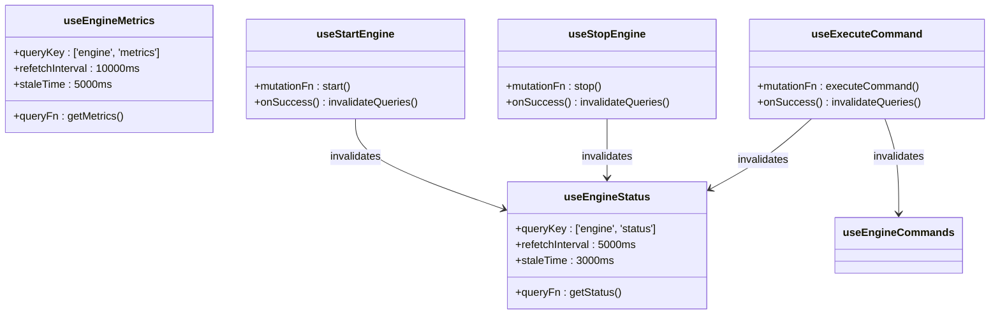

# Engine Control Interface

<cite>
**Referenced Files in This Document**   
- [EngineControl.tsx](file://frontend/src/pages/EngineControl.tsx)
- [StateMachineVisualizer.tsx](file://frontend/src/components/ui/StateMachineVisualizer.tsx)
- [useEngine.ts](file://frontend/src/hooks/useEngine.ts)
- [engine.py](file://breakout_bot/api/routers/engine.py)
- [websocket.py](file://breakout_bot/api/websocket.py)
</cite>

## Table of Contents
1. [Introduction](#introduction)
2. [Core Functionality](#core-functionality)
3. [State Machine Visualization](#state-machine-visualization)
4. [State Synchronization Mechanisms](#state-synchronization-mechanisms)
5. [Usage Patterns and Safety Procedures](#usage-patterns-and-safety-procedures)
6. [Visual Feedback Elements](#visual-feedback-elements)
7. [Code Implementation and Hooks](#code-implementation-and-hooks)
8. [Edge Cases and Recovery](#edge-cases-and-recovery)

## Introduction
The Engine Control interface provides comprehensive management capabilities for the trading engine lifecycle. This documentation details the interactive controls, state visualization components, and synchronization mechanisms that enable users to safely operate the trading system. The interface integrates with backend services through API endpoints and WebSocket connections to provide real-time feedback and control over engine operations.

## Core Functionality

The Engine Control page enables users to manage the trading engine through four primary operations: start, stop, pause, and resume. These actions are implemented as interactive buttons that trigger corresponding API endpoints in the backend system.

The Start operation initializes the trading engine with a selected preset configuration and trading mode (paper or live). The Stop operation terminates engine execution and releases associated resources. The Pause function temporarily suspends engine activities while maintaining state, allowing for resumption without reinitialization. The Resume operation restores normal operation after a pause state.

Commands are dynamically enabled based on the current engine state, ensuring only valid operations are available at any given time. For example, when the engine is idle, only Start and Reload commands are available, while during active trading, Stop, Pause, and emergency commands become accessible.

**Section sources**
- [EngineControl.tsx](file://frontend/src/pages/EngineControl.tsx#L122-L150)
- [engine.py](file://breakout_bot/api/routers/engine.py#L434-L477)

## State Machine Visualization

### StateMachineVisualizer Component

The StateMachineVisualizer component renders the current state of the trading engine in a graphical format, enhancing situational awareness for operators. It displays states such as SCANNING, SIGNAL_GENERATION, EXECUTION, and others through a combination of badges, icons, and descriptive text.

**Diagram sources**
- [StateMachineVisualizer.tsx](file://frontend/src/components/ui/StateMachineVisualizer.tsx#L51-L87)
- [engine.py](file://breakout_bot/api/routers/engine.py)

Each state is represented with a distinct color and emoji icon for quick visual recognition:
- **Scanning**: 🔍 Blue badge indicating market scanning activity
- **Execution**: ⚡ Green badge showing active trade execution
- **Paused**: ⏸️ Yellow badge representing suspended operations
- **Error**: ❌ Red badge signaling system errors

The component also displays historical state transitions, showing the sequence of state changes with timestamps and transition reasons. Users can expand individual transitions to view detailed metadata about the change event.

**Section sources**
- [StateMachineVisualizer.tsx](file://frontend/src/components/ui/StateMachineVisualizer.tsx#L0-L311)

## State Synchronization Mechanisms

### WebSocket and Polling Integration

The Engine Control interface maintains real-time synchronization between the frontend and backend through a dual mechanism combining WebSocket events and HTTP polling.

WebSocket connections provide immediate updates for critical state changes. The frontend establishes a persistent connection to the server's WebSocket endpoint, receiving ENGINE_UPDATE messages whenever the engine state changes. Each message contains the current state value and running status, enabling instant UI updates without latency.

**Diagram sources**
- [websocket.py](file://breakout_bot/api/websocket.py#L57-L92)
- [useWebSocketStore.ts](file://frontend/src/store/useWebSocketStore.ts#L64-L97)

For non-critical metrics and fallback scenarios, the system employs HTTP polling via React Query hooks. The useEngineStatus hook polls the /status endpoint every 5 seconds, while useEngineMetrics queries the /metrics endpoint every 10 seconds. This hybrid approach ensures reliable state synchronization even if WebSocket connections are temporarily disrupted.

The system prioritizes WebSocket updates but falls back to polling data if real-time updates are unavailable, ensuring continuous operation monitoring under various network conditions.

**Section sources**
- [websocket.py](file://breakout_bot/api/websocket.py#L0-L179)
- [useEngine.ts](file://frontend/src/hooks/useEngine.ts#L0-L45)

## Usage Patterns and Safety Procedures

### Safe Engine Operation Guidelines

The interface implements several safety procedures to prevent accidental disruptions during active trading. Before executing a stop command during active trades, the system requires explicit confirmation through disabled controls and visual warnings.

When selecting a preset configuration, users must choose from predefined JSON files located in the config/presets directory. The selection dropdown is disabled during engine operation to prevent configuration changes while trading. Trading mode (paper/live) selection follows the same restriction pattern.

Critical operations like Kill Switch and Panic Exit are visually distinguished with red outline buttons and require deliberate user action. These commands are only available when the engine is in active states (scanning, execution, managing), preventing accidental activation during idle periods.

The interface enforces a state-based command availability system. Available commands are determined by querying the /commands endpoint, which returns different command sets based on current engine state:
- **Idle**: Start, Reload
- **Running**: Stop, Pause, Emergency Commands
- **Paused**: Resume, Stop, Reload
- **Error**: Retry, Stop, Reload

This prevents invalid state transitions and guides users toward appropriate recovery actions.

**Section sources**
- [EngineControl.tsx](file://frontend/src/pages/EngineControl.tsx#L25-L60)
- [engine.py](file://breakout_bot/api/routers/engine.py#L434-L477)

## Visual Feedback Elements

### Loading States and Status Indicators

The interface incorporates multiple visual feedback elements to communicate system status during asynchronous operations. Loading spinners appear within action buttons when commands are being processed, accompanied by descriptive text like "Starting Engine..." or "Stopping Engine...".

Status badges provide immediate visual indication of engine state using color-coded indicators:
- **Success (Green)**: Active trading states (execution, managing)
- **Warning (Yellow)**: Paused or transitional states
- **Danger (Red)**: Error or emergency conditions
- **Secondary (Gray)**: Idle or stopped states

Metric cards display key performance indicators including uptime, cycle count, average latency, and total signals generated. These update automatically as new data becomes available from the backend.

Alert banners appear below control panels when command execution fails, displaying error messages returned from the API. These alerts help diagnose issues such as invalid presets or network connectivity problems.

The StateMachineVisualizer includes a compact mode option that reduces information density for dashboard integration while maintaining essential state information.

**Section sources**
- [EngineControl.tsx](file://frontend/src/pages/EngineControl.tsx#L189-L216)
- [StateMachineVisualizer.tsx](file://frontend/src/components/ui/StateMachineVisualizer.tsx#L0-L311)

## Code Implementation and Hooks

### useEngine Hook Architecture

The useEngine hooks provide a structured interface for state synchronization between the frontend and backend systems. These React Query hooks encapsulate API interactions and cache management for optimal performance.

**Diagram sources**
- [useEngine.ts](file://frontend/src/hooks/useEngine.ts#L0-L92)

The useEngineStatus hook retrieves engine state every 5 seconds, caching results for 3 seconds before considering them stale. Similarly, useEngineMetrics fetches performance data every 10 seconds. Mutation hooks (useStartEngine, useStopEngine) handle command execution and automatically invalidate relevant query caches upon successful completion, ensuring the UI reflects the most current state.

Error handling is implemented through React Query's built-in error states, with mutation error objects containing detailed failure information displayed in alert components.

**Section sources**
- [useEngine.ts](file://frontend/src/hooks/useEngine.ts#L0-L92)
- [EngineControl.tsx](file://frontend/src/pages/EngineControl.tsx#L308-L326)

## Edge Cases and Recovery

### Network Disconnection and Recovery

The system handles network disconnections through multiple redundancy mechanisms. When WebSocket connections drop, the interface continues to receive state updates through HTTP polling until the connection can be reestablished.

If both WebSocket and polling fail, the UI displays appropriate error messages and enters a degraded mode, preserving the last known state while attempting automatic reconnection. The heartbeat mechanism detects connection health, with missed heartbeats triggering reconnect attempts.

For command failures, the system provides detailed error feedback including specific error codes and messages from the backend. Failed commands can be retried manually through the interface. The retry mechanism includes exponential backoff to prevent overwhelming the server during transient failures.

In cases of engine crashes or unexpected terminations, the monitoring manager records checkpoint data that can be used for post-mortem analysis. The system logs state transitions and command executions, enabling reconstruction of events leading to failures.

Recovery procedures include the Retry command for error states, Reload for configuration refresh, and full restart sequences for complete system resets. The kill switch functionality provides immediate termination capability in emergency situations.

**Section sources**
- [websocket.py](file://breakout_bot/api/websocket.py#L57-L92)
- [engine.py](file://breakout_bot/api/routers/engine.py#L434-L477)
- [useEngine.ts](file://frontend/src/hooks/useEngine.ts#L47-L91)