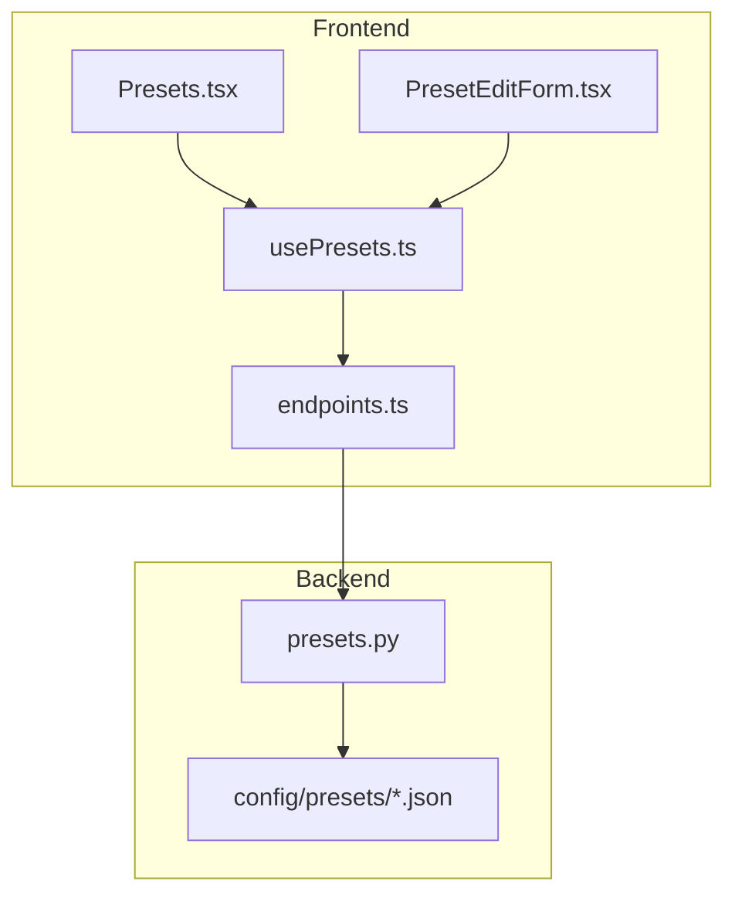
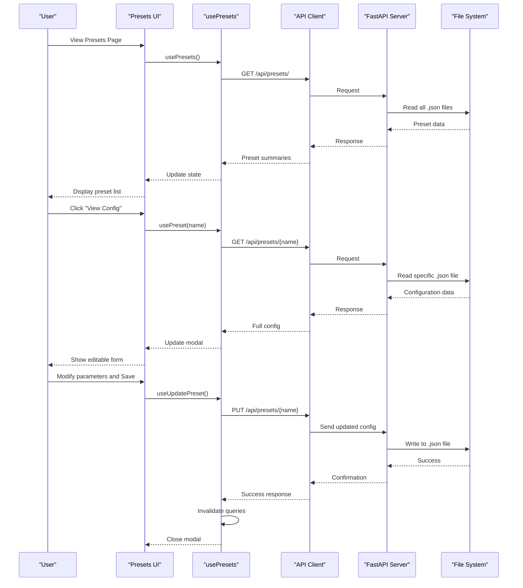
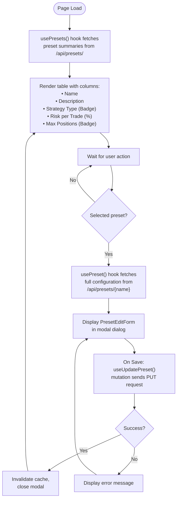
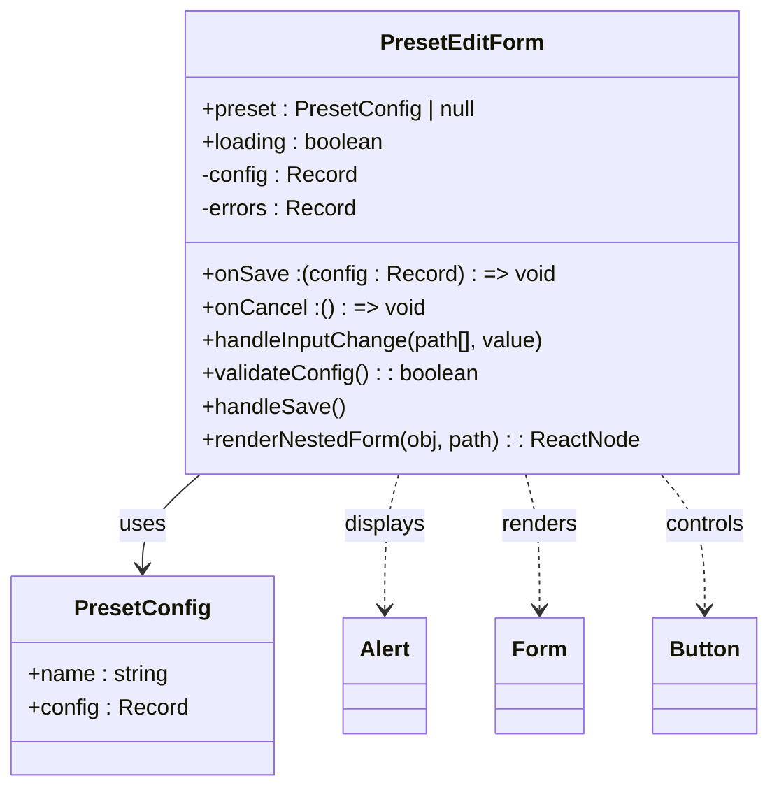
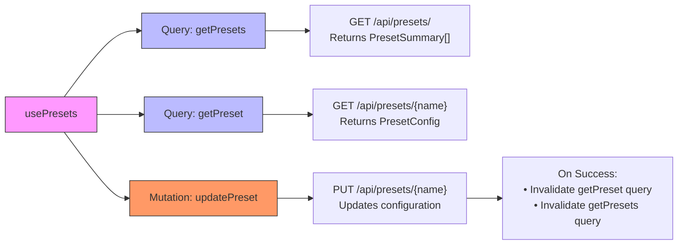
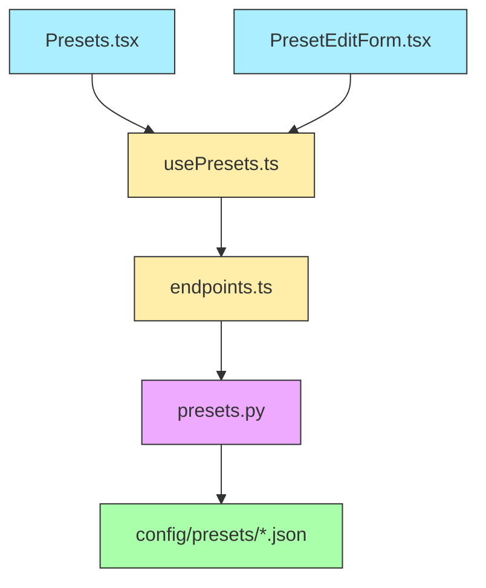

# Preset Management UI

<cite>
**Referenced Files in This Document**
- [Presets.tsx](file://frontend/src/pages/Presets.tsx)
- [PresetEditForm.tsx](file://frontend/src/components/PresetEditForm.tsx)
- [usePresets.ts](file://frontend/src/hooks/usePresets.ts)
- [presets.py](file://breakout_bot/api/routers/presets.py)
- [breakout_v1.json](file://breakout_bot/config/presets/breakout_v1.json)
- [endpoints.ts](file://frontend/src/api/endpoints.ts)
</cite>

## Table of Contents
1. [Introduction](#introduction)
2. [Project Structure](#project-structure)
3. [Core Components](#core-components)
4. [Architecture Overview](#architecture-overview)
5. [Detailed Component Analysis](#detailed-component-analysis)
6. [Dependency Analysis](#dependency-analysis)
7. [Performance Considerations](#performance-considerations)
8. [Troubleshooting Guide](#troubleshooting-guide)
9. [Conclusion](#conclusion)

## Introduction
The Preset Management interface enables users to manage trading strategy configurations through a comprehensive UI for viewing, selecting, editing, and saving presets. The system integrates frontend components with backend API endpoints to provide real-time synchronization of configuration changes across clients. This documentation details the implementation of the Presets page, the PresetEditForm component, and the underlying data flow between UI elements and server-side storage.

## Project Structure
The preset management functionality spans both frontend and backend components within the repository. Frontend code resides in the `frontend/src` directory with dedicated files for pages, components, hooks, and API endpoints. Backend implementation is located in the `breakout_bot/api/routers` module, with configuration files stored in `breakout_bot/config/presets`.

**Diagram sources**
- [Presets.tsx](file://frontend/src/pages/Presets.tsx)
- [PresetEditForm.tsx](file://frontend/src/components/PresetEditForm.tsx)
- [usePresets.ts](file://frontend/src/hooks/usePresets.ts)
- [endpoints.ts](file://frontend/src/api/endpoints.ts)
- [presets.py](file://breakout_bot/api/routers/presets.py)

**Section sources**
- [Presets.tsx](file://frontend/src/pages/Presets.tsx)
- [PresetEditForm.tsx](file://frontend/src/components/PresetEditForm.tsx)
- [presets.py](file://breakout_bot/api/routers/presets.py)

## Core Components
The preset management system consists of three primary components: the Presets page for displaying available configurations, the PresetEditForm for inline parameter editing, and the usePresets hook for managing CRUD operations against the API. These components work together to provide a seamless experience for modifying trading strategy parameters including scan filters, signal thresholds, risk limits, and position sizing rules.

**Section sources**
- [Presets.tsx](file://frontend/src/pages/Presets.tsx#L1-L140)
- [PresetEditForm.tsx](file://frontend/src/components/PresetEditForm.tsx#L1-L191)
- [usePresets.ts](file://frontend/src/hooks/usePresets.ts#L1-L48)

## Architecture Overview
The preset management architecture follows a client-server pattern with React Query handling state management on the frontend and FastAPI providing RESTful endpoints on the backend. Configuration data is persisted as JSON files in the filesystem, accessed through standardized API routes that support listing, retrieving, and updating preset configurations.

**Diagram sources**
- [Presets.tsx](file://frontend/src/pages/Presets.tsx#L1-L140)
- [usePresets.ts](file://frontend/src/hooks/usePresets.ts#L1-L48)
- [presets.py](file://breakout_bot/api/routers/presets.py#L1-L107)

## Detailed Component Analysis

### Presets Page Analysis
The Presets page displays a table of available trading strategy configurations with metadata including name, description, risk level, and strategy type. Users can select any preset to view and edit its full configuration through a modal interface.

**Diagram sources**
- [Presets.tsx](file://frontend/src/pages/Presets.tsx#L1-L140)

**Section sources**
- [Presets.tsx](file://frontend/src/pages/Presets.tsx#L1-L140)

### PresetEditForm Component Analysis
The PresetEditForm component provides an interactive interface for editing nested configuration parameters. It supports recursive rendering of complex objects and includes validation mechanisms to prevent invalid configurations.

**Diagram sources**
- [PresetEditForm.tsx](file://frontend/src/components/PresetEditForm.tsx#L1-L191)

**Section sources**
- [PresetEditForm.tsx](file://frontend/src/components/PresetEditForm.tsx#L1-L191)

### usePresets Hook Analysis
The usePresets hook encapsulates all API interactions for preset management, leveraging React Query for efficient data fetching, caching, and mutation handling. It ensures synchronization across clients by invalidating relevant queries after successful updates.

**Diagram sources**
- [usePresets.ts](file://frontend/src/hooks/usePresets.ts#L1-L48)
- [endpoints.ts](file://frontend/src/api/endpoints.ts#L83-L120)

**Section sources**
- [usePresets.ts](file://frontend/src/hooks/usePresets.ts#L1-L48)

## Dependency Analysis
The preset management system has well-defined dependencies between frontend and backend components. The UI layers depend on hooks for data access, which in turn rely on API endpoints that communicate with server-side routers.

**Diagram sources**
- [Presets.tsx](file://frontend/src/pages/Presets.tsx)
- [PresetEditForm.tsx](file://frontend/src/components/PresetEditForm.tsx)
- [usePresets.ts](file://frontend/src/hooks/usePresets.ts)
- [endpoints.ts](file://frontend/src/api/endpoints.ts)
- [presets.py](file://breakout_bot/api/routers/presets.py)

**Section sources**
- [usePresets.ts](file://frontend/src/hooks/usePresets.ts#L1-L48)
- [endpoints.ts](file://frontend/src/api/endpoints.ts#L83-L120)
- [presets.py](file://breakout_bot/api/routers/presets.py#L1-L107)

## Performance Considerations
The preset management system implements several performance optimizations:
- Client-side caching with 5-minute stale time for preset data
- Selective query invalidation to minimize unnecessary refetching
- Efficient JSON file I/O operations on the server side
- Lazy loading of full preset configurations only when needed

These optimizations ensure responsive UI performance while maintaining data consistency across multiple clients.

## Troubleshooting Guide
Common issues in the preset management system typically involve configuration validation failures or file system access problems. The system provides user feedback through form validation messages and handles errors gracefully at both client and server levels.

**Section sources**
- [PresetEditForm.tsx](file://frontend/src/components/PresetEditForm.tsx#L54-L128)
- [presets.py](file://breakout_bot/api/routers/presets.py#L25-L107)

## Conclusion
The Preset Management UI provides a robust interface for configuring trading strategies with proper validation, error handling, and real-time synchronization. By aligning UI fields with the underlying JSON schema used in breakout_bot/config/presets/*.json files, the system ensures consistency between frontend inputs and backend expectations. While the current implementation does not explicitly address concurrency concerns for multiple users editing the same preset simultaneously, the atomic file write operations provide basic protection against data corruption.