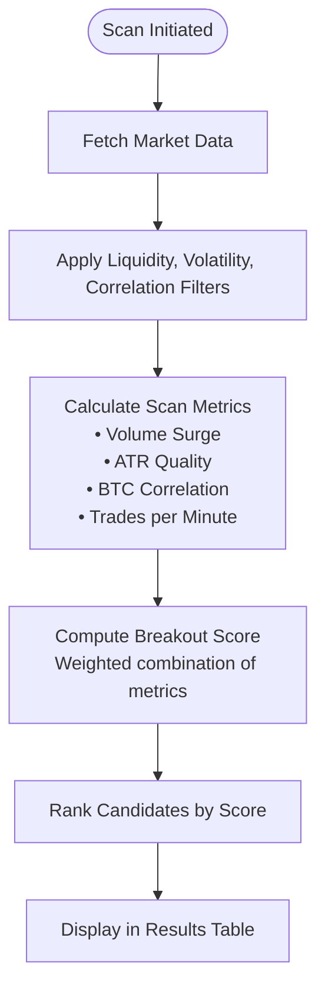
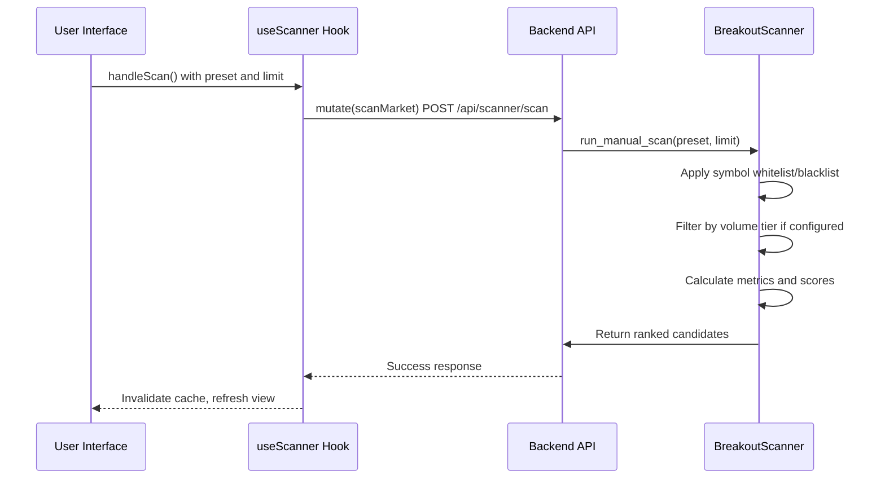
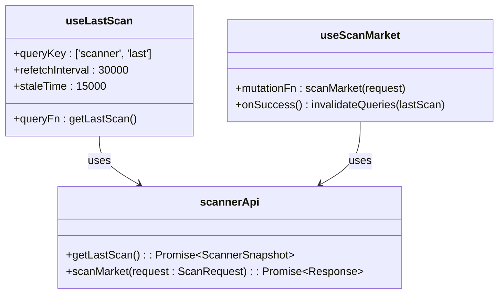

# Scanner Results View

<cite>
**Referenced Files in This Document**   
- [Scanner.tsx](file://frontend/src/pages/Scanner.tsx)
- [useScanner.ts](file://frontend/src/hooks/useScanner.ts)
- [EventFeed.tsx](file://frontend/src/components/EventFeed.tsx)
- [scanner.py](file://breakout_bot/api/routers/scanner.py)
- [market_scanner.py](file://breakout_bot/scanner/market_scanner.py)
</cite>

## Table of Contents
1. [Introduction](#introduction)
2. [Table Structure and Metrics](#table-structure-and-metrics)
3. [Sorting, Filtering, and Search Capabilities](#sorting-filtering-and-search-capapilities)
4. [useScanner Hook Implementation](#usescanner-hook-implementation)
5. [EventFeed Component for Auditability](#eventfeed-component-for-auditability)
6. [Interpreting Scanner Rankings with Presets](#interpreting-scanner-rankings-with-presets)
7. [Performance Considerations](#performance-considerations)
8. [Troubleshooting Guide](#troubleshooting-guide)

## Introduction
The Scanner Results page provides real-time visibility into market scan outputs, enabling users to identify breakout candidates based on configurable scoring criteria. The interface integrates with the backend scanner engine to retrieve candidate assets ranked by breakout score, volatility, liquidity, and correlation metrics. Users can trigger scans using predefined presets, adjust result limits, and monitor outcomes through a live-updating table. The system leverages WebSocket connections for live updates and maintains auditability via an event feed that logs all scanning activities.

**Section sources**
- [Scanner.tsx](file://frontend/src/pages/Scanner.tsx#L1-L205)
- [scanner.py](file://breakout_bot/api/routers/scanner.py#L1-L239)

## Table Structure and Metrics
The results table displays candidate assets with key performance indicators derived from multi-dimensional analysis:

| Column | Description |
|-------|-------------|
| Symbol | Trading pair identifier (e.g., BTC/USDT) |
| Score | Composite breakout score (0.0–1.0), color-coded: green ≥0.8, yellow ≥0.6, gray <0.6 |
| Vol Surge | Volume surge ratio over 1h and 5m periods, displayed as multiplier (e.g., "2.3x") |
| ATR Quality | Normalized Average True Range metric indicating volatility quality |
| Correlation | Absolute correlation coefficient with BTC price movement |
| Trades/min | Number of trades executed per minute as liquidity indicator |
| Filters | Visual badges showing which filters passed (green) or failed (red) |

Each row represents a scanned asset with its associated metrics and filter status. The table supports dynamic rendering of complex data types through custom render functions that transform raw values into user-friendly visual elements.

**Diagram sources**
- [market_scanner.py](file://breakout_bot/scanner/market_scanner.py#L1-L787)
- [Scanner.tsx](file://frontend/src/pages/Scanner.tsx#L20-L60)

**Section sources**
- [Scanner.tsx](file://frontend/src/pages/Scanner.tsx#L20-L60)
- [market_scanner.py](file://breakout_bot/scanner/market_scanner.py#L1-L787)

## Sorting, Filtering, and Search Capabilities
Users interact with scan results through several refinement mechanisms:

- **Preset Selection**: Dropdown menu populated with available trading presets (e.g., `high_liquidity_top30`, `scalping_high_freq`) loaded from configuration files
- **Scan Limit Control**: Numeric input allowing users to set result count (1–50), defaulting to 10
- **Manual Scan Trigger**: Button initiates new scan using selected preset and limit parameters

The interface does not currently support client-side sorting or filtering of displayed results; these operations are handled server-side during the scanning process. Search functionality is limited to symbol-based filtering configured within presets rather than free-text search across results.

When a user selects a preset and clicks "Scan Market", the system validates inputs and submits a request containing:
- `preset`: Name of selected scanning strategy
- `limit`: Maximum number of candidates to return

**Diagram sources**
- [Scanner.tsx](file://frontend/src/pages/Scanner.tsx#L100-L150)
- [useScanner.ts](file://frontend/src/hooks/useScanner.ts#L1-L35)
- [scanner.py](file://breakout_bot/api/routers/scanner.py#L100-L200)

**Section sources**
- [Scanner.tsx](file://frontend/src/pages/Scanner.tsx#L100-L150)
- [useScanner.ts](file://frontend/src/hooks/useScanner.ts#L1-L35)

## useScanner Hook Implementation
The `useScanner` hook manages data retrieval and caching for the scanner interface using React Query:

- **useLastScan**: Queries `/api/scanner/last` endpoint every 30 seconds with 15-second stale time
- **useScanMarket**: Mutation hook that posts to `/api/scanner/scan` and invalidates cache upon success

The hook implements automatic cache management by invalidating the last scan query after successful manual scans, ensuring fresh data appears immediately. It handles loading states, errors, and success notifications through React Query's built-in status tracking.

Key features:
- Automatic background refetching at 30-second intervals
- Cache invalidation after mutations
- Error handling with descriptive messages from API responses
- Loading state synchronization with UI components

**Diagram sources**
- [useScanner.ts](file://frontend/src/hooks/useScanner.ts#L1-L35)
- [endpoints.ts](file://frontend/src/api/endpoints.ts#L100-L110)

**Section sources**
- [useScanner.ts](file://frontend/src/hooks/useScanner.ts#L1-L35)

## EventFeed Component for Auditability
The EventFeed component provides real-time logging of system events including scanning activities. Although primarily designed for order and position events, it serves as the foundation for audit trails by displaying timestamped entries with contextual metadata.

Features:
- Displays events in reverse chronological order
- Categorizes events by type (orders, positions)
- Shows relative timestamps (e.g., "2 minutes ago")
- Color-codes entries by status (pending, filled, cancelled)

Currently, scanning-specific events such as "new candidate detected" or "filter applied" are not explicitly logged through this component. However, the architecture supports extension to include scanner events by integrating with the monitoring manager's session tracking system, which records scanning sessions, symbols scanned, and candidates found.

**Section sources**
- [EventFeed.tsx](file://frontend/src/components/EventFeed.tsx#L1-L128)

## Interpreting Scanner Rankings with Presets
Scanner rankings must be interpreted in context with the active preset configuration. Each preset defines distinct scoring weights and filtering thresholds that alter candidate evaluation:

- **High Liquidity Presets**: Prioritize markets with deep order books and tight spreads
- **Breakout Strategies**: Emphasize volume surges and ATR quality metrics
- **Momentum Approaches**: Weight recent price changes and trading activity heavily

For example, a candidate scoring 0.85 under `top_gainers_momentum.json` reflects strong upward price action and increasing volume, while the same score under `high_liquidity_top30.json` indicates exceptional market depth and stability. Users should understand that absolute scores lack meaning without reference to the underlying preset logic.

The system currently returns mock candidate data due to incomplete integration between the monitoring manager and actual scan results, limiting the accuracy of ranking interpretation until full implementation.

**Section sources**
- [market_scanner.py](file://breakout_bot/scanner/market_scanner.py#L500-L700)
- [scanner.py](file://breakout_bot/api/routers/scanner.py#L50-L100)

## Performance Considerations
The implementation addresses performance through several strategies:

- **Virtualized Rendering**: Not currently implemented; large datasets may impact rendering performance
- **Debounce Settings**: Not applicable; search inputs are absent in current design
- **Caching Strategy**: React Query caches last scan results with 15-second staleness and 30-second refetch interval
- **Batch Processing**: Backend scanner processes markets in batches of 5 for parallel execution
- **WebSocket Integration**: Planned but not fully utilized for live updates

Potential improvements include implementing virtual scrolling for large result sets and adding debounce to any future search inputs to prevent excessive API calls during typing.

**Section sources**
- [market_scanner.py](file://breakout_bot/scanner/market_scanner.py#L300-L400)
- [useScanner.ts](file://frontend/src/hooks/useScanner.ts#L10-L20)

## Troubleshooting Guide
Common issues and diagnostic steps:

### Delayed Updates
1. Verify WebSocket connection status in browser developer tools
2. Check network tab for failed `/api/scanner/last` requests
3. Confirm backend engine is running and scanning cycle is active
4. Review server logs for scanner-related errors

### Missing Entries
1. Validate preset selection matches currently running engine configuration
2. Check if symbols are filtered out by whitelist/blacklist rules
3. Inspect market data availability for specific symbols
4. Examine filter thresholds in preset configuration (e.g., minimum volume, spread limits)

### Connection Diagnostics
- Test API connectivity: `GET /api/health`
- Verify scanner endpoint: `GET /api/scanner/last`
- Check engine status: `GET /api/engine/status`
- Monitor WebSocket connection in browser console

### Log Inspection
Relevant log locations:
- Frontend: Browser console messages
- Backend: Server logs containing "scanner" or "monitoring_manager" entries
- Diagnostic collector: Session-specific scanning diagnostics when enabled

Ensure the engine is initialized with the correct preset before scanning, as mismatched configurations will prevent scan execution.

**Section sources**
- [scanner.py](file://breakout_bot/api/routers/scanner.py#L50-L150)
- [engine.py](file://breakout_bot/core/engine.py#L500-L700)