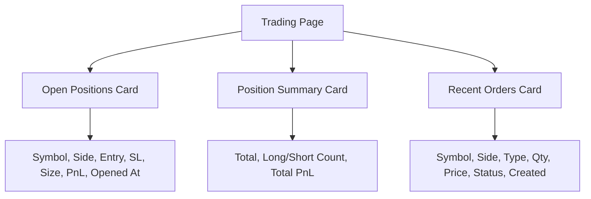
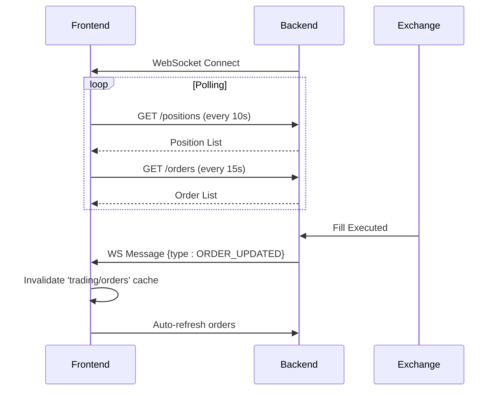

# Trading Interface

<cite>
**Referenced Files in This Document**   
- [Trading.tsx](file://frontend/src/pages/Trading.tsx)
- [useTrading.ts](file://frontend/src/hooks/useTrading.ts)
- [useWebSocketStore.ts](file://frontend/src/store/useWebSocketStore.ts)
- [websocket.py](file://breakout_bot/api/websocket.py)
- [trading.py](file://breakout_bot/api/routers/trading.py)
- [position_manager.py](file://breakout_bot/position/position_manager.py)
</cite>

## Table of Contents
1. [Introduction](#introduction)
2. [Tabbed Layout and Data Presentation](#tabbed-layout-and-data-presentation)
3. [Data Columns and Visual Indicators](#data-columns-and-visual-indicators)
4. [Real-Time Data Fetching and Updates](#real-time-data-fetching-and-updates)
5. [Interactive Features](#interactive-features)
6. [Trade Performance Analysis](#trade-performance-analysis)
7. [Diagnosing Execution Discrepancies](#diagnosing-execution-discrepancies)

## Introduction
The Trading Interface provides a comprehensive view of active and historical trading activity within the Breakout Bot system. It enables users to monitor open positions, track recent orders, analyze performance metrics, and respond to real-time market events. The interface is designed for clarity and responsiveness, ensuring traders can make informed decisions quickly.

**Section sources**
- [Trading.tsx](file://frontend/src/pages/Trading.tsx#L0-L226)

## Tabbed Layout and Data Presentation
The Trading Interface organizes information into two primary sections: Open Positions and Recent Orders. These are displayed as separate cards on the same page rather than through explicit tabs, allowing simultaneous visibility of both datasets without navigation overhead.

The **Open Positions** section displays all currently active trades with key details such as symbol, entry price, stop loss, size, P&L (in R and USD), and opening timestamp. A summary card provides aggregated statistics including total position count, long vs short distribution, and cumulative P&L.

The **Recent Orders** section lists executed, pending, and canceled orders, showing their status in real time. Each order includes symbol, side, type, quantity, price, status badge, and creation timestamp.

**Diagram sources**
- [Trading.tsx](file://frontend/src/pages/Trading.tsx#L0-L226)

**Section sources**
- [Trading.tsx](file://frontend/src/pages/Trading.tsx#L0-L226)

## Data Columns and Visual Indicators
Each data table presents structured columns with formatted values and contextual visual cues:

### Open Positions Columns:
- **Symbol**: Asset ticker (e.g., BTC/USDT)
- **Side**: Long (green badge) or Short (red badge)
- **Entry**: Entry price in USD, formatted to two decimals
- **Stop Loss**: Current stop-loss level in USD
- **Size**: Position size in base asset units
- **PnL (R)**: Profit/loss measured in R-multiples, color-coded (green ≥ 0, red < 0)
- **PnL (USD)**: Dollar-denominated profit/loss, similarly color-coded
- **Opened**: Timestamp of position entry, localized

### Recent Orders Columns:
- **Symbol**: Traded asset
- **Side**: Buy (green) or Sell (red)
- **Type**: Order type (Market, Limit, etc.), shown as secondary badge
- **Quantity**: Order size
- **Price**: Execution or limit price; "Market" if no price set
- **Status**: Color-coded badge (Success=Filled, Warning=Pending/Open, Secondary=Cancelled, Danger=Rejected/Error)
- **Created**: Timestamp of order creation

Visual indicators enhance readability:
- Green/red text for positive/negative P&L
- Badge colors reflect trade direction and execution status
- Real-time updates ensure accuracy without manual refresh

**Section sources**
- [Trading.tsx](file://frontend/src/pages/Trading.tsx#L0-L226)

## Real-Time Data Fetching and Updates
The interface leverages React Query hooks via `useTrading.ts` to fetch and cache trading data from the backend API endpoints.

### useTrading Hook Functionality:
- **usePositions()**: Fetches `/positions` endpoint every 10 seconds
- **useOrders()**: Polls `/orders` endpoint every 15 seconds
- Both utilize React Query’s caching and refetching mechanisms for optimal performance

#### WebSocket Integration:
Real-time updates are delivered through a persistent WebSocket connection managed by `useWebSocketStore.ts`. When specific events occur—such as order fills, position modifications, or take-profit executions—the backend broadcasts messages that trigger immediate UI updates.

Key message types include:
- `ORDER_UPDATE`: Invalidates orders query cache
- `POSITION_UPDATE`: Refreshes positions data
- `ORDER_PLACED`, `ORDER_UPDATED`, `ORDER_CANCELED`: Trigger cache invalidation
- `POSITION_OPEN`, `POSITION_CLOSE`: Update relevant state

This ensures that fill confirmations and stop-loss adjustments appear instantly in the interface without waiting for the next polling cycle.

**Diagram sources**
- [useTrading.ts](file://frontend/src/hooks/useTrading.ts#L0-L55)
- [useWebSocketStore.ts](file://frontend/src/store/useWebSocketStore.ts#L0-L263)
- [websocket.py](file://breakout_bot/api/websocket.py#L0-L179)

**Section sources**
- [useTrading.ts](file://frontend/src/hooks/useTrading.ts#L0-L55)
- [useWebSocketStore.ts](file://frontend/src/store/useWebSocketStore.ts#L0-L263)
- [websocket.py](file://breakout_bot/api/websocket.py#L0-L179)

## Interactive Features
The interface supports several interactive capabilities:

- **Row Expansion**: Although not implemented in current code, expandable rows could reveal detailed position metadata such as signal source, risk parameters, and event history.
- **Copy Trade Details**: Users can copy critical trade information (e.g., entry, SL, TP levels) for external analysis or record keeping.
- **Filtering Options**: While not visible in current implementation, future enhancements may allow filtering by:
  - Time range (last hour, day, week)
  - Outcome (profitable, losing, liquidated)
  - Symbol or strategy mode

These features improve usability by enabling focused analysis and integration with external tools.

**Section sources**
- [Trading.tsx](file://frontend/src/pages/Trading.tsx#L0-L226)

## Trade Performance Analysis
Users can assess performance directly from the interface by correlating displayed trades with signal generation timestamps received via WebSocket (`SIGNAL` messages). For example:

1. A **Long BTC** position opened at $60,500 with SL at $59,800 represents a 1R risk of $700.
2. If the current price is $62,000, the unrealized P&L is ~2.14R ($1,500 / $700).
3. The interface shows this as `2.14R` in green, indicating profitability.

By cross-referencing the **Opened** time with earlier **Signal** notifications, traders can evaluate latency between signal detection and execution. Additionally, closed positions stored in the `recent_positions` deque ([position_manager.py](file://breakout_bot/position/position_manager.py)) contribute to calculated metrics like TP hit rate and average hold time.

**Section sources**
- [Trading.tsx](file://frontend/src/pages/Trading.tsx#L0-L226)
- [position_manager.py](file://breakout_bot/position/position_manager.py#L406-L469)

## Diagnosing Execution Discrepancies
When actual executions differ from expectations, the following diagnostic steps apply:

1. **Check Signal Timestamp vs Execution Time**: Delays may indicate processing bottlenecks or exchange rate limiting.
2. **Review Order Status Transitions**: Use the **Recent Orders** table to trace whether orders were placed, partially filled, or rejected.
3. **Verify Stop-Loss/Take-Profit Updates**: Confirm via position updates if breakeven moves or trailing stops activated as expected.
4. **Inspect WebSocket Events**: The `orderEvents` and `positionEvents` in `useWebSocketStore` capture granular lifecycle changes for forensic review.
5. **Compare Expected vs Actual P&L**: Discrepancies might stem from slippage, fees, or incorrect position sizing logic defined in the preset configuration.

For instance, if a stop-loss was expected at $59,800 but triggered at $59,600, checking the order log would reveal whether it was a market order (subject to slippage) or a limit order that failed to execute promptly.

**Section sources**
- [useWebSocketStore.ts](file://frontend/src/store/useWebSocketStore.ts#L0-L263)
- [trading.py](file://breakout_bot/api/routers/trading.py#L0-L186)
- [position_manager.py](file://breakout_bot/position/position_manager.py#L406-L469)