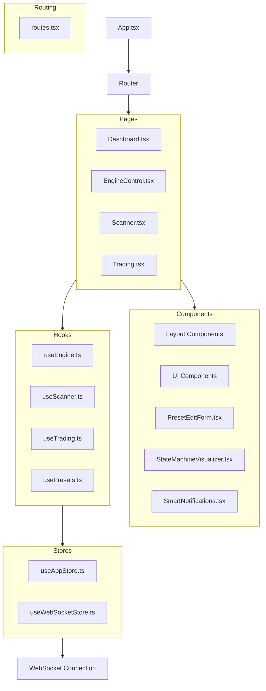
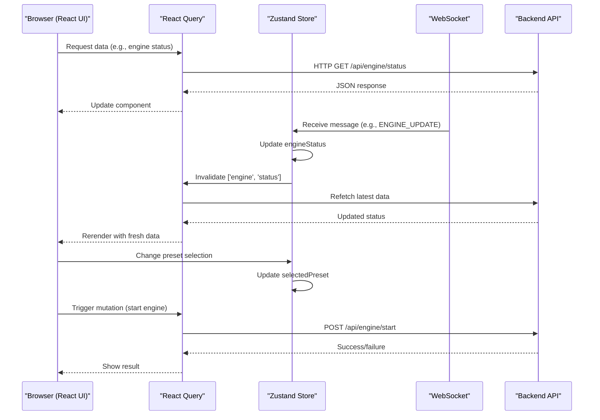
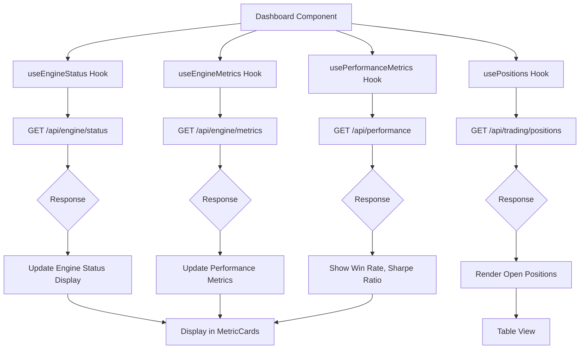
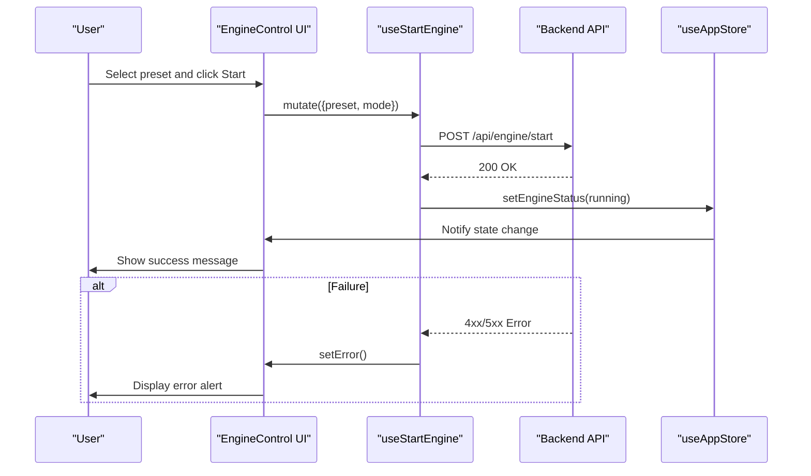
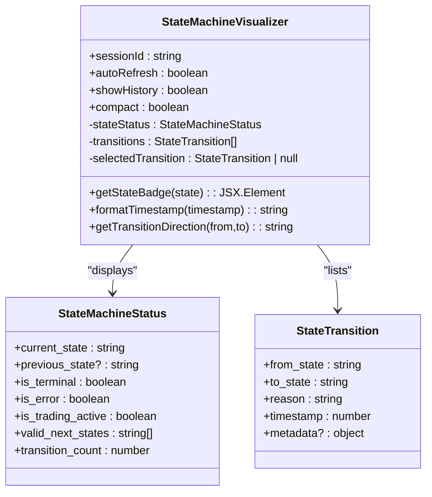
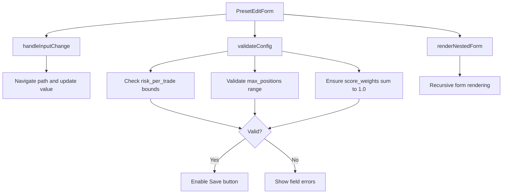
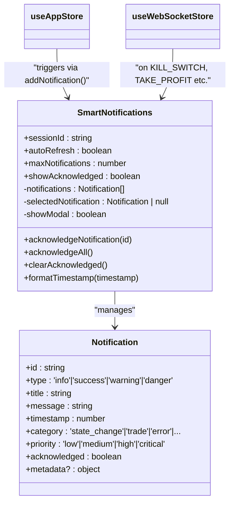
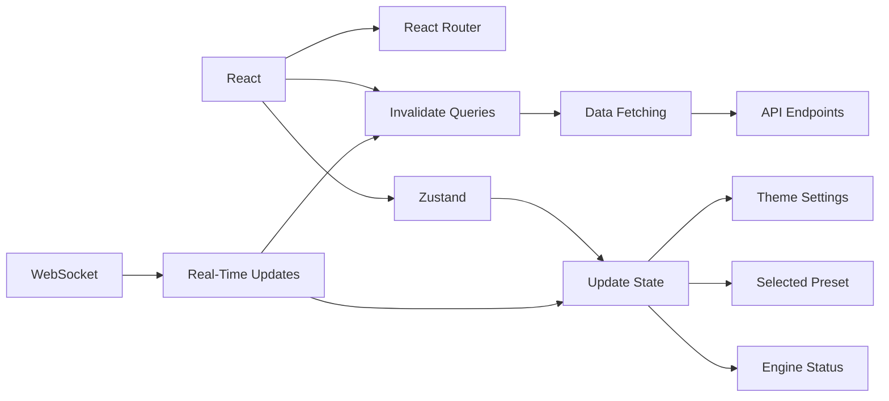

# User Interface Guide

<cite>
**Referenced Files in This Document**   
- [App.tsx](file://frontend/src/App.tsx)
- [routes.tsx](file://frontend/src/router/routes.tsx)
- [useAppStore.ts](file://frontend/src/store/useAppStore.ts)
- [useWebSocketStore.ts](file://frontend/src/store/useWebSocketStore.ts)
- [StateMachineVisualizer.tsx](file://frontend/src/components/ui/StateMachineVisualizer.tsx)
- [SmartNotifications.tsx](file://frontend/src/components/ui/SmartNotifications.tsx)
- [PresetEditForm.tsx](file://frontend/src/components/PresetEditForm.tsx)
- [useEngine.ts](file://frontend/src/hooks/useEngine.ts)
- [useScanner.ts](file://frontend/src/hooks/useScanner.ts)
- [Dashboard.tsx](file://frontend/src/pages/Dashboard.tsx)
- [EngineControl.tsx](file://frontend/src/pages/EngineControl.tsx)
- [Scanner.tsx](file://frontend/src/pages/Scanner.tsx)
- [Trading.tsx](file://frontend/src/pages/Trading.tsx)
</cite>

## Table of Contents
1. [Introduction](#introduction)
2. [Project Structure](#project-structure)
3. [Core Components](#core-components)
4. [Architecture Overview](#architecture-overview)
5. [Detailed Component Analysis](#detailed-component-analysis)
6. [Dependency Analysis](#dependency-analysis)
7. [Performance Considerations](#performance-considerations)
8. [Troubleshooting Guide](#troubleshooting-guide)
9. [Conclusion](#conclusion)

## Introduction
This document provides comprehensive documentation for the React-based user interface of a trading system, designed to offer visual control and monitoring capabilities. The UI enables users to manage engine operations, monitor real-time market scanning, track active trades, and configure strategy presets. Built with React 18, TypeScript, and React Router, the application integrates with backend services via REST APIs and WebSocket connections for real-time updates. State management is handled through Zustand for global state and React Query for data fetching and caching. Key interactive components include the StateMachineVisualizer for engine state visualization, PresetEditForm for strategy configuration, and SmartNotifications for alerting on critical events.

## Project Structure
The frontend application follows a modular structure organized by functional areas: pages, components, hooks, and stores. Pages represent major views accessible via routing, while components encapsulate reusable UI elements. Custom hooks abstract API interactions and data handling logic, and Zustand stores manage global application state including engine status, theme preferences, and WebSocket connections.



**Diagram sources**
- [App.tsx](file://frontend/src/App.tsx)
- [routes.tsx](file://frontend/src/router/routes.tsx)

**Section sources**
- [App.tsx](file://frontend/src/App.tsx)
- [routes.tsx](file://frontend/src/router/routes.tsx)

## Core Components
The core functionality of the UI revolves around four main pages—Dashboard, EngineControl, Scanner, and Trading—each serving distinct operational purposes. These pages leverage shared components such as StateMachineVisualizer, SmartNotifications, and PresetEditForm to provide consistent interaction patterns. Data flows from API endpoints through React Query hooks into UI components, with global state managed via Zustand stores. WebSocket connections enable real-time updates for engine status, order executions, and system alerts, ensuring users have up-to-date information without manual refreshes.

**Section sources**
- [Dashboard.tsx](file://frontend/src/pages/Dashboard.tsx)
- [EngineControl.tsx](file://frontend/src/pages/EngineControl.tsx)
- [Scanner.tsx](file://frontend/src/pages/Scanner.tsx)
- [Trading.tsx](file://frontend/src/pages/Trading.tsx)

## Architecture Overview
The application architecture follows a layered pattern with clear separation between presentation, data access, and state management layers. React Query handles data fetching, caching, and synchronization with the backend API, while Zustand manages global UI state such as theme settings, sidebar state, and WebSocket connectivity. Real-time updates are delivered via WebSocket messages that trigger cache invalidation in React Query and dispatch notifications through the Zustand store.



**Diagram sources**
- [useEngine.ts](file://frontend/src/hooks/useEngine.ts)
- [useWebSocketStore.ts](file://frontend/src/store/useWebSocketStore.ts)
- [useAppStore.ts](file://frontend/src/store/useAppStore.ts)

## Detailed Component Analysis

### Dashboard Page
The Dashboard provides an overview of system performance and health metrics, aggregating key indicators into a single view for quick assessment. It displays engine status, performance statistics, position summaries, and recent trades using MetricCard components. Data is fetched asynchronously via React Query hooks that poll the backend at regular intervals.

#### Data Flow and Integration


**Diagram sources**
- [Dashboard.tsx](file://frontend/src/pages/Dashboard.tsx)
- [useEngine.ts](file://frontend/src/hooks/useEngine.ts)
- [useTrading.ts](file://frontend/src/hooks/useTrading.ts)

**Section sources**
- [Dashboard.tsx](file://frontend/src/pages/Dashboard.tsx)

### EngineControl Page
The EngineControl page allows users to start, stop, pause, and issue emergency commands to the trading engine. It integrates with multiple hooks to display current engine state, available commands, and system metrics. Users can select strategy presets and trading modes (paper/live) before initiating engine operations.

#### Command Execution Workflow


**Diagram sources**
- [EngineControl.tsx](file://frontend/src/pages/EngineControl.tsx)
- [useEngine.ts](file://frontend/src/hooks/useEngine.ts)
- [useAppStore.ts](file://frontend/src/store/useAppStore.ts)

**Section sources**
- [EngineControl.tsx](file://frontend/src/pages/EngineControl.tsx)

### Scanner Page
The Scanner page displays real-time market candidates identified by the system's scanning module. It shows ranking scores, signal strength, and relevant technical indicators. The component uses `useLastScan` to retrieve scan results and supports manual triggering of new scans via `useScanMarket`.

#### Real-Time Update Mechanism
```mermaid
flowchart LR
A[Scanner Component] --> B[useLastScan Hook]
B --> C[GET /api/scanner/last-scan]
C --> D[Display Results]
E[WebSocket Message] --> |SCAN_RESULT| F[useWebSocketStore]
F --> G[Invalidate ['scanner','last']]
G --> H[Refetch Scan Data]
H --> D
```

**Diagram sources**
- [Scanner.tsx](file://frontend/src/pages/Scanner.tsx)
- [useScanner.ts](file://frontend/src/hooks/useScanner.ts)
- [useWebSocketStore.ts](file://frontend/src/store/useWebSocketStore.ts)

**Section sources**
- [Scanner.tsx](file://frontend/src/pages/Scanner.tsx)

### Trading Page
The Trading page presents active positions and execution history, allowing users to monitor ongoing trades and review past outcomes. It leverages `useTrading` hooks to fetch orders, positions, and trade logs, with real-time updates pushed via WebSocket for order placements and position changes.

### Interactive Components

#### StateMachineVisualizer
This component graphically represents the current state of the trading engine and its transition history. It uses color-coded badges and directional icons to indicate state changes and includes detailed metadata on click.



**Diagram sources**
- [StateMachineVisualizer.tsx](file://frontend/src/components/ui/StateMachineVisualizer.tsx)

**Section sources**
- [StateMachineVisualizer.tsx](file://frontend/src/components/ui/StateMachineVisualizer.tsx)

#### PresetEditForm
Enables modification of strategy parameters within a selected preset. Supports nested configuration editing with validation rules for risk settings and scanner weights.



**Diagram sources**
- [PresetEditForm.tsx](file://frontend/src/components/PresetEditForm.tsx)

**Section sources**
- [PresetEditForm.tsx](file://frontend/src/components/PresetEditForm.tsx)

#### SmartNotifications
Displays intelligent alerts based on system events, state changes, and performance thresholds. Automatically generates notifications for critical conditions like high CPU usage or state transitions.



**Diagram sources**
- [SmartNotifications.tsx](file://frontend/src/components/ui/SmartNotifications.tsx)
- [useAppStore.ts](file://frontend/src/store/useAppStore.ts)
- [useWebSocketStore.ts](file://frontend/src/store/useWebSocketStore.ts)

**Section sources**
- [SmartNotifications.tsx](file://frontend/src/components/ui/SmartNotifications.tsx)

## Dependency Analysis
The application relies on several key dependencies for state management, routing, and UI rendering. React Query handles data synchronization and caching, reducing redundant API calls and improving responsiveness. Zustand provides lightweight global state management with middleware support for persistence and devtools. WebSocket connections are maintained independently but integrated with React Query for cache invalidation upon real-time events.



**Diagram sources**
- [App.tsx](file://frontend/src/App.tsx)
- [useAppStore.ts](file://frontend/src/store/useAppStore.ts)
- [useWebSocketStore.ts](file://frontend/src/store/useWebSocketStore.ts)

**Section sources**
- [App.tsx](file://frontend/src/App.tsx)
- [useAppStore.ts](file://frontend/src/store/useAppStore.ts)
- [useWebSocketStore.ts](file://frontend/src/store/useWebSocketStore.ts)

## Performance Considerations
The UI is optimized for efficient data loading and minimal re-renders. React Query's caching mechanism ensures that API responses are reused across components, with configurable stale times and refetch intervals. WebSocket-driven updates prevent unnecessary polling by invalidating only relevant query caches when real-time events occur. Large lists are paginated or limited in display (e.g., showing only top 5 recent positions), and heavy computations are offloaded to the backend. Zustand's selective subscription model prevents unnecessary component updates when unrelated state changes occur.

## Troubleshooting Guide
Common UI issues and their resolutions:

- **Stale Data Display**: If metrics appear outdated, check WebSocket connection status in the footer. A disconnected state indicates lost real-time updates; the system will attempt automatic reconnection every 5 seconds.
- **Unresponsive Controls**: Buttons may be disabled due to current engine state (e.g., cannot start while running). Check the "Available Commands" section in EngineControl for permitted actions.
- **Missing Notifications**: Ensure `VITE_WS_URL` is correctly configured in environment variables and that the backend WebSocket server is reachable.
- **Preset Not Saving**: Validation errors in PresetEditForm (e.g., risk_per_trade out of bounds or score_weights not summing to 1.0) will prevent saving. Review highlighted fields.
- **Slow Rendering**: Large scan results or excessive notifications can impact performance. The system automatically limits displayed items to maintain responsiveness.

**Section sources**
- [useWebSocketStore.ts](file://frontend/src/store/useWebSocketStore.ts)
- [PresetEditForm.tsx](file://frontend/src/components/PresetEditForm.tsx)
- [SmartNotifications.tsx](file://frontend/src/components/ui/SmartNotifications.tsx)

## Conclusion
The React-based UI provides a comprehensive interface for monitoring and controlling a sophisticated trading system. Through well-structured components, effective state management, and real-time data synchronization, it delivers a responsive and informative experience. The integration of React Query for data handling and Zustand for global state enables scalable and maintainable code, while WebSocket connectivity ensures timely updates without excessive server load. Future enhancements could include customizable dashboards, advanced filtering in the Scanner, and deeper historical analysis tools.