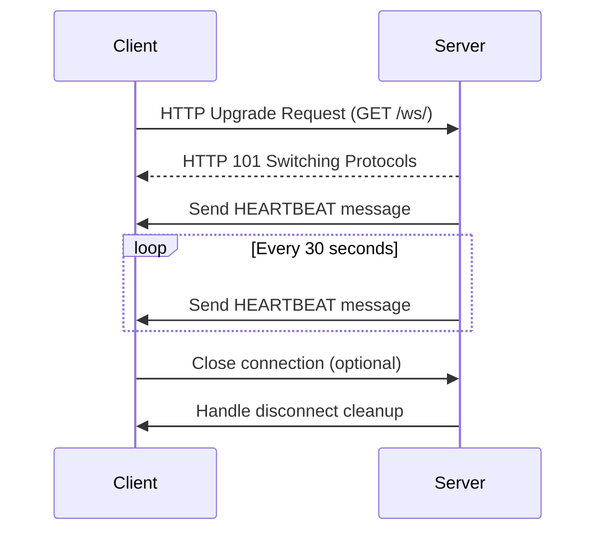
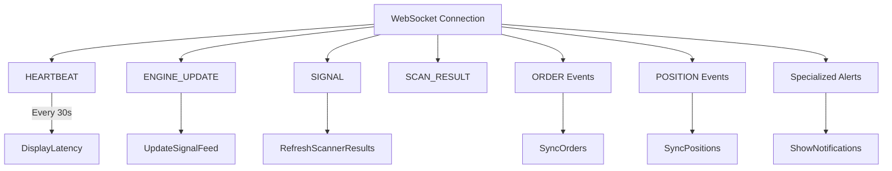
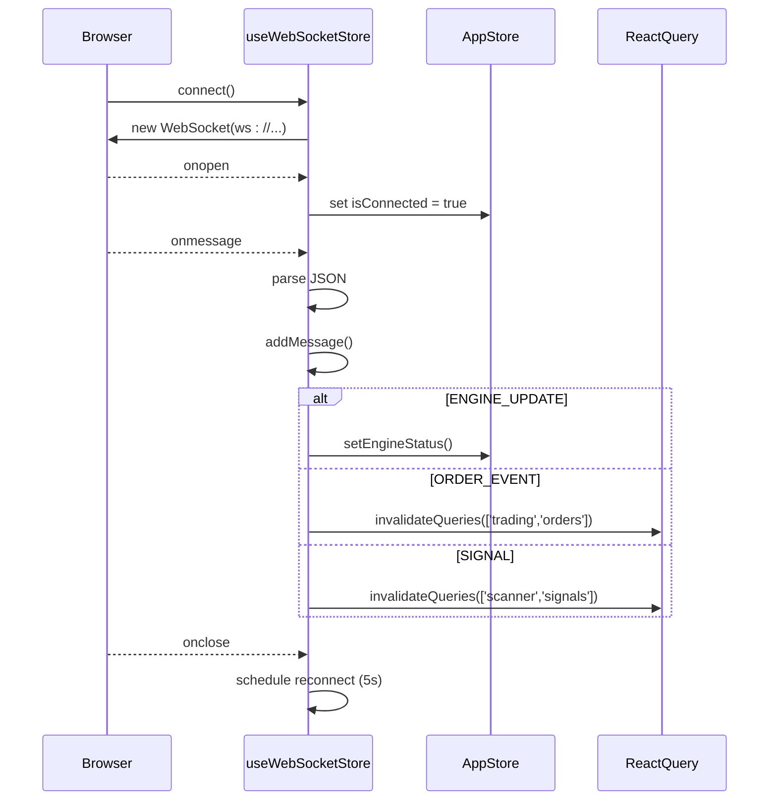
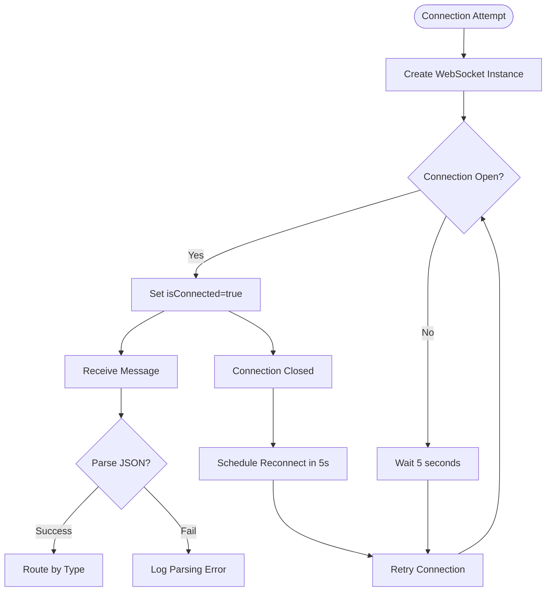

# WebSocket Interface

<cite>
**Referenced Files in This Document**   
- [websocket.py](file://breakout_bot/api/websocket.py)
- [api.ts](file://frontend/src/types/api.ts)
- [client.ts](file://frontend/src/api/client.ts)
- [useWebSocketStore.ts](file://frontend/src/store/useWebSocketStore.ts)
</cite>

## Table of Contents
1. [Introduction](#introduction)
2. [Connection Protocol](#connection-protocol)
3. [Message Types](#message-types)
4. [Payload Structures](#payload-structures)
5. [Client-Side Handling](#client-side-handling)
6. [State Synchronization](#state-synchronization)
7. [Code Examples](#code-examples)
8. [Reliability Features](#reliability-features)
9. [Performance Considerations](#performance-considerations)
10. [Security Aspects](#security-aspects)
11. [Debugging Tools](#debugging-tools)

## Introduction
The WebSocket interface enables real-time bidirectional communication between the server and frontend for the trading engine. It provides live updates on engine status, market signals, position changes, trade executions, scanner results, and error notifications. The system uses a persistent connection to deliver low-latency updates critical for timely decision-making in automated trading workflows.

This documentation details the protocol, message types, client integration patterns, reliability mechanisms, and operational considerations for consuming real-time data through the WebSocket API.

## Connection Protocol

The WebSocket connection is established via an HTTP upgrade handshake at the `/ws/` endpoint. The server implements a FastAPI WebSocket router that handles connection lifecycle management, including authentication (if enabled), session tracking, and graceful disconnection.

Once connected, the server sends an initial heartbeat message immediately after accepting the connection. Subsequently, periodic heartbeat messages are sent every 30 seconds to maintain liveness and monitor connection health. The heartbeat includes latency metrics to help clients assess network performance.



**Diagram sources**
- [websocket.py](file://breakout_bot/api/websocket.py#L57-L92)

**Section sources**
- [websocket.py](file://breakout_bot/api/websocket.py#L0-L179)

## Message Types

The server publishes several event types over the WebSocket connection:

- **ENGINE_UPDATE**: Current state of the trading engine (e.g., IDLE, RUNNING, ERROR)
- **SIGNAL**: New trading signal detected by the system
- **SCAN_RESULT**: Results from market scanning operations
- **ORDER_PLACED**, **ORDER_UPDATED**, **ORDER_CANCELED**: Order lifecycle events
- **POSITION_OPEN**, **POSITION_UPDATE**, **POSITION_CLOSE**: Position lifecycle events
- **HEARTBEAT**: Periodic keep-alive message with latency information

Additional specialized events include:
- **STOP_MOVED**: Stop loss adjustment notification
- **TAKE_PROFIT**: Take profit execution alert
- **KILL_SWITCH**: Emergency shutdown activation

These messages enable the frontend to reflect real-time changes across all aspects of the trading system.



**Diagram sources**
- [websocket.py](file://breakout_bot/api/websocket.py#L89-L178)
- [api.ts](file://frontend/src/types/api.ts#L204-L204)

**Section sources**
- [websocket.py](file://breakout_bot/api/websocket.py#L89-L178)

## Payload Structures

All messages follow a standardized format defined by the `WebSocketMessage` TypeScript interface:

```typescript
interface WebSocketMessage {
  type: string;
  ts: number; // timestamp in milliseconds
  data: any;
}
```

Specific payload structures are derived from backend Pydantic models and mirrored in frontend type definitions (`frontend/src/types/api.ts`). Key interfaces include:

- **EngineStatus**: Contains current engine state, running status, mode (paper/live), and performance metrics
- **Candidate**: Market candidate with score, filter results, and technical metrics
- **ScannerSnapshot**: Collection of scan results with metadata
- **OrderEvent**: Order creation, update, or cancellation details
- **PositionEvent**: Position opening, modification, or closure information

Each message type carries relevant domain-specific data under the `data` field, ensuring type safety and predictable parsing on the client side.

**Section sources**
- [api.ts](file://frontend/src/types/api.ts#L0-L251)

## Client-Side Handling

The frontend establishes and manages WebSocket connections using native browser APIs wrapped within a dedicated Zustand store (`useWebSocketStore`). This abstraction provides a clean interface for connecting, sending messages, and handling incoming events.

Key responsibilities of the client handler:
- Establish connection using environment-configurable URL (`VITE_WS_URL`)
- Reconnect automatically after disconnections (5-second retry delay)
- Parse incoming JSON messages and route them based on `type`
- Maintain message history (last 100 messages)
- Handle connection errors gracefully with logging

The implementation ensures robust operation even under unstable network conditions.



**Diagram sources**
- [useWebSocketStore.ts](file://frontend/src/store/useWebSocketStore.ts#L0-L62)
- [useWebSocketStore.ts](file://frontend/src/store/useWebSocketStore.ts#L64-L97)

**Section sources**
- [useWebSocketStore.ts](file://frontend/src/store/useWebSocketStore.ts#L0-L263)

## State Synchronization

Real-time state synchronization is achieved through coordinated actions between the WebSocket store and application state management systems:

- Engine status updates are propagated to `useAppStore` to reflect current operational state
- Order and position events trigger React Query cache invalidation to refresh UI components
- Special events (STOP_MOVED, TAKE_PROFIT) generate user-facing notifications
- Heartbeat messages update last known activity timestamp for monitoring purposes

This architecture ensures that both visual components and underlying data caches remain consistent with the server's current state without requiring frequent polling.

**Section sources**
- [useWebSocketStore.ts](file://frontend/src/store/useWebSocketStore.ts#L97-L187)

## Code Examples

### Establishing Connection
```typescript
const { connect, disconnect, sendMessage } = useWebSocketStore();

// Connect to WebSocket server
connect();

// Disconnect when needed
disconnect();
```

### Listening to Events
```typescript
// Subscribe to messages via Zustand store
useWebSocketStore.subscribe((state) => {
  console.log('Last message:', state.lastMessage);
});

// Or directly handle specific events
const handleMessage = (event: MessageEvent) => {
  const message: WebSocketMessage = JSON.parse(event.data);
  
  switch (message.type) {
    case 'ENGINE_UPDATE':
      console.log('Engine state:', message.data.state);
      break;
    case 'SIGNAL':
      console.log('New signal:', message.data.signals);
      break;
  }
};

const socket = new WebSocket(import.meta.env.VITE_WS_URL || 'ws://localhost:8000/ws/');
socket.onmessage = handleMessage;
```

### Handling Disconnections Gracefully
Automatic reconnection logic is built into the store:
```typescript
socket.onclose = () => {
  set({ isConnected: false });
  
  // Auto-reconnect after 5 seconds
  setTimeout(() => {
    if (!get().isConnected) {
      get().connect();
    }
  }, 5000);
};
```

**Section sources**
- [useWebSocketStore.ts](file://frontend/src/store/useWebSocketStore.ts#L0-L263)
- [client.ts](file://frontend/src/api/client.ts#L0-L100)

## Reliability Features

The WebSocket implementation includes multiple reliability mechanisms:

- **Reconnect Logic**: Automatic reconnection attempts every 5 seconds after disconnection
- **Error Handling**: Comprehensive try-catch blocks around message sending and parsing
- **Connection Cleanup**: Proper removal of disconnected clients from active connections list
- **Robust Broadcasting**: Individual error handling during broadcast to prevent one failed client from affecting others
- **Message Buffering**: Client-side storage of recent messages and events (limited to 100 items)

These features ensure continuous operation despite transient network issues or temporary server unavailability.



**Diagram sources**
- [useWebSocketStore.ts](file://frontend/src/store/useWebSocketStore.ts#L189-L260)

**Section sources**
- [websocket.py](file://breakout_bot/api/websocket.py#L0-L179)
- [useWebSocketStore.ts](file://frontend/src/store/useWebSocketStore.ts#L189-L260)

## Performance Considerations

To optimize bandwidth usage and processing overhead:

- Messages are sent in compressed JSON format
- Updates are batched within each heartbeat cycle (every 30 seconds)
- Only changed data is transmitted; full snapshots are avoided when possible
- Client maintains local state to minimize redundant processing
- Server limits message frequency to prevent overwhelming clients

For high-frequency scenarios, consider filtering only essential event types on the client side to reduce processing load.

**Section sources**
- [websocket.py](file://breakout_bot/api/websocket.py#L57-L178)

## Security Aspects

Security measures implemented for the WebSocket interface:

- **Origin Validation**: Server can be configured to validate Origin header during handshake
- **Environment-Based URLs**: WebSocket URL configured via environment variables to prevent hardcoded production endpoints in development
- **No Sensitive Data in Logs**: Error messages avoid exposing credentials or private keys
- **Input Sanitization**: All incoming messages are validated before processing (though currently no inbound messaging functionality exists)

Future enhancements could include JWT-based authentication during connection establishment.

**Section sources**
- [websocket.py](file://breakout_bot/api/websocket.py#L0-L179)
- [client.ts](file://frontend/src/api/client.ts#L0-L100)

## Debugging Tools

Several tools assist in debugging WebSocket communication:

- **Browser DevTools**: Inspect WebSocket frames under Network tab → WS connection
- **Console Logging**: Client logs connection events, errors, and message parsing failures
- **Message History**: Store keeps last 100 messages for inspection
- **Server-Side Logging**: Backend logs connection/disconnection events and transmission errors
- **Zustand Devtools**: Integrated Redux DevTools-style debugging for WebSocket store state

Developers can monitor real-time message flow, inspect payloads, and diagnose connectivity issues using these tools.

**Section sources**
- [useWebSocketStore.ts](file://frontend/src/store/useWebSocketStore.ts#L0-L263)
- [websocket.py](file://breakout_bot/api/websocket.py#L0-L179)