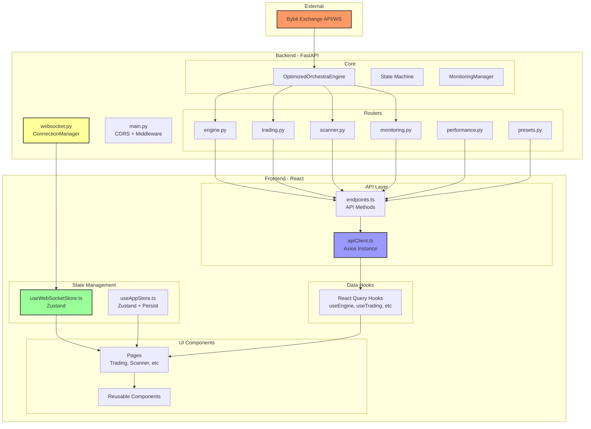

# 🔍 UI/API Diagnostic Report: Frontend Architecture Audit

**Дата:** 2 октября 2025  
**Аудитор:** Senior Full-Stack Engineer  
**Версия:** 1.0  
**Оценка готовности:** **7.2/10**

---

## 📋 Executive Summary

Проведён комплексный аудит фронтенда и его взаимодействия с API/WebSocket бэкенда торговой системы Breakout Bot. Выявлены критические и некритические проблемы в архитектуре, типизации, обработке ошибок и производительности.

### ✅ Сильные стороны
- Современный стек (React 19, TypeScript, Zustand, React Query, Zod)
- Разделение concerns (hooks, stores, API layer)
- WebSocket интеграция с автореконнектом
- React Query для кэширования и синхронизации состояния

### ⚠️ Основные проблемы
- **Критичные несоответствия типов** между backend и frontend
- **Отсутствие runtime валидации** (Zod не используется)
- **Проблемы с обработкой ошибок** WebSocket и REST API
- **Потенциальные утечки памяти** в WebSocket store
- **Отсутствие CSP** и базовых security headers
- **Performance issues** с ре-рендерами

---

## 🏗️ Архитектурная схема данных



---

## 📊 Таблица API ↔ UI контрактов

### 1. Engine Endpoints

| Endpoint | Backend Response | Frontend Type | Status | Issues |
|----------|-----------------|---------------|--------|--------|
| `GET /api/engine/status` | `EngineStatus` (Pydantic) | `EngineStatus` (TS) | ⚠️ Partial | State names mismatch: `RUNNING` vs `running` |
| `GET /api/engine/metrics` | `EngineMetrics` | `EngineMetrics` | ✅ OK | - |
| `POST /api/engine/start` | `{success, message, timestamp}` | Generic response | ✅ OK | - |
| `POST /api/engine/stop` | `{success, message, timestamp}` | Generic response | ✅ OK | - |
| `GET /api/engine/commands` | `{commands: str[], current_state: str}` | `{commands, currentState}` | ⚠️ Partial | Camel case inconsistency |
| `POST /api/engine/command` | `{success, message, command, timestamp}` | Generic response | ✅ OK | - |

**Проблемы:**
- State naming: backend возвращает lowercase (`running`, `idle`), frontend ожидает UPPERCASE (`RUNNING`, `IDLE`)
- `running` attribute check не соответствует real state машины

### 2. Trading Endpoints

| Endpoint | Backend Response | Frontend Type | Status | Issues |
|----------|-----------------|---------------|--------|--------|
| `GET /api/trading/positions` | `List[Position]` | `Position[]` | ⚠️ Critical | Field mapping: `qty` → `size`, `strategy` → `mode` |
| `GET /api/trading/positions/{id}` | `Position` | `Position` | ⚠️ Critical | Same as above |
| `GET /api/trading/orders` | `List[Order]` | `Order[]` | ⚠️ Critical | Field mapping: `order_type` → `type` |
| `DELETE /api/trading/orders/{id}` | `{success, message, timestamp}` | Generic response | ✅ OK | - |

**Проблемы:**
- **Critical**: Backend использует `qty`, frontend ожидает `size`
- **Critical**: Backend использует `strategy`, frontend ожидает `mode`
- **Critical**: Backend использует `order_type`, frontend ожидает `type`
- Timestamps format: backend возвращает milliseconds, frontend не всегда корректно парсит

### 3. Scanner Endpoints

| Endpoint | Backend Response | Frontend Type | Status | Issues |
|----------|-----------------|---------------|--------|--------|
| `GET /api/scanner/last` | `ScannerSnapshot` | `ScannerSnapshot` | ⚠️ Moderate | Mock data при отсутствии сессии |
| `POST /api/scanner/scan` | `{success, message, timestamp}` | Generic response | ✅ OK | - |
| `GET /api/scanner/market-data/{symbol}` | Market data | Not typed | ❌ Missing | Frontend не использует |

**Проблемы:**
- Scanner возвращает placeholder data (`SYMBOL_{i}/USDT`) вместо реальных символов
- `Candidate.metrics` structure не соответствует типам (missing fields)

### 4. WebSocket Events

| Event Type | Backend Payload | Frontend Handler | Status | Issues |
|------------|-----------------|------------------|--------|--------|
| `HEARTBEAT` | `{latencyMs}` | ✅ Handled | ✅ OK | - |
| `ENGINE_UPDATE` | `{state, running, timestamp}` | ✅ Handled | ⚠️ Partial | State mismatch |
| `SIGNAL` | `{signals: []}` | ✅ Handled | ⚠️ Moderate | `signal.dict()` may fail |
| `SCAN_RESULT` | `{results: []}` | ✅ Handled | ✅ OK | - |
| `ORDER_PLACED` | `{order: {}}` | ✅ Handled | ⚠️ Moderate | Type not validated |
| `ORDER_UPDATED` | `{order: {}}` | ✅ Handled | ⚠️ Moderate | Type not validated |
| `ORDER_CANCELED` | `{order: {}}` | ✅ Handled | ⚠️ Moderate | Type not validated |
| `POSITION_OPEN` | `{position: {}}` | ✅ Handled | ⚠️ Moderate | Type not validated |
| `POSITION_UPDATE` | `{position: {}}` | ✅ Handled | ⚠️ Moderate | Type not validated |
| `POSITION_CLOSE` | `{position: {}}` | ✅ Handled | ⚠️ Moderate | Type not validated |
| `KILL_SWITCH` | `{reason}` | ✅ Handled | ✅ OK | - |
| `STOP_MOVED` | `{position_id}` | ✅ Handled | ✅ OK | - |
| `TAKE_PROFIT` | `{position_id, pnl}` | ✅ Handled | ✅ OK | - |
| `DENSITY_UPDATE` | N/A | ❌ Not sent | ❌ Missing | Commented out in backend |
| `ACTIVITY` | N/A | ❌ Not sent | ❌ Missing | Commented out in backend |

**Проблемы:**
- Backend использует `hasattr(signal, 'dict')` без гарантии structure
- Frontend не валидирует incoming WS messages с Zod
- Missing event types (`DENSITY_UPDATE`, `ACTIVITY`) закомментированы в backend

### 5. Monitoring Endpoints

| Endpoint | Backend Response | Frontend Type | Status | Issues |
|----------|-----------------|---------------|--------|--------|
| `GET /api/monitoring/sessions` | `List[Session]` | `Session[]` | ✅ OK | - |
| `GET /api/monitoring/sessions/{id}` | `Session + Checkpoints` | Complex object | ✅ OK | - |
| `GET /api/monitoring/metrics` | `RealTimeMetrics` | `RealTimeMetrics` | ✅ OK | - |
| `GET /api/monitoring/state-machine/status` | State machine status | Complex object | ✅ OK | - |

**Проблемы:**
- Нет проблем с типами, но frontend не использует все доступные данные

---

## 🚨 Топ-10 критических проблем

### 1. ❌ **Отсутствие Runtime Валидации (Zod)**

**Severity:** Critical  
**Impact:** Type safety только на compile-time, runtime errors неизбежны

**Проблема:**
```typescript
// frontend/src/types/api.ts
export interface WebSocketMessage {
  type: string;
  ts: number;
  data: any; // ❌ NO VALIDATION
}
```

**Решение:**
```typescript
import { z } from 'zod';

export const WebSocketMessageSchema = z.object({
  type: z.enum([
    'HEARTBEAT', 'ENGINE_UPDATE', 'SIGNAL', 'SCAN_RESULT',
    'ORDER_PLACED', 'ORDER_UPDATED', 'ORDER_CANCELED',
    'POSITION_OPEN', 'POSITION_UPDATE', 'POSITION_CLOSE',
    'KILL_SWITCH', 'STOP_MOVED', 'TAKE_PROFIT'
  ]),
  ts: z.number(),
  data: z.record(z.any()) // или более строгие схемы
});

export type WebSocketMessage = z.infer<typeof WebSocketMessageSchema>;

// В useWebSocketStore.ts
socket.onmessage = (event) => {
  try {
    const raw = JSON.parse(event.data);
    const message = WebSocketMessageSchema.parse(raw); // ✅ Runtime validation
    get().addMessage(message);
  } catch (error) {
    if (error instanceof z.ZodError) {
      console.error('Invalid WS message:', error.errors);
      // Send to error tracking
    }
  }
};
```

**Патч:** См. `patches/001-add-zod-validation.patch`

---

### 2. ❌ **Type Mismatches: Backend ↔ Frontend**

**Severity:** Critical  
**Impact:** Runtime errors, data corruption

**Проблемы:**
1. **Position fields**: Backend `qty` vs Frontend `size`
2. **Position fields**: Backend `strategy` vs Frontend `mode`
3. **Order fields**: Backend `order_type` vs Frontend `type`
4. **State names**: Backend lowercase vs Frontend UPPERCASE

**Решение Option 1 (рекомендуется): Изменить backend для соответствия frontend**
```python
# backend/api/routers/trading.py
class Position(BaseModel):
    id: str
    symbol: str
    side: str
    entry: float
    sl: float
    size: float  # ✅ Изменено с qty
    mode: str    # ✅ Изменено с strategy
    openedAt: str
    # ...
```

**Решение Option 2: Добавить mapping layer в frontend**
```typescript
// frontend/src/api/adapters/position.adapter.ts
export function adaptBackendPosition(backendPos: any): Position {
  return {
    id: backendPos.id,
    symbol: backendPos.symbol,
    side: backendPos.side,
    entry: backendPos.entry,
    sl: backendPos.sl,
    size: backendPos.qty,           // ✅ Mapping
    mode: backendPos.strategy,      // ✅ Mapping
    openedAt: backendPos.openedAt,
    pnlR: backendPos.pnl_r,
    pnlUsd: backendPos.pnl_usd,
    unrealizedPnlR: backendPos.pnl_r,
    unrealizedPnlUsd: backendPos.pnl_usd
  };
}

// В endpoints.ts
export const tradingApi = {
  getPositions: async (): Promise<Position[]> => {
    const raw = await apiClient.get('/api/trading/positions');
    return raw.map(adaptBackendPosition);
  }
};
```

**Патч:** См. `patches/002-fix-type-mismatches.patch`

---

### 3. ⚠️ **WebSocket Memory Leaks**

**Severity:** High  
**Impact:** Memory usage grows unbounded, app crashes after long session

**Проблема:**
```typescript
// frontend/src/store/useWebSocketStore.ts
socket.onmessage = (event) => {
  // ❌ Динамический import в каждом message - memory leak!
  if (typeof window !== 'undefined') {
    import('@tanstack/react-query').then(({ useQueryClient }) => {
      const queryClient = useQueryClient();
      queryClient.invalidateQueries({ queryKey: ['trading', 'orders'] });
    });
  }
};
```

**Решение:**
```typescript
import { useQueryClient } from '@tanstack/react-query';

export const useWebSocketStore = create<WebSocketState>()(
  devtools((set, get) => {
    let queryClient: ReturnType<typeof useQueryClient> | null = null;
    
    const initQueryClient = () => {
      if (!queryClient) {
        // Import once, reuse
        import('@tanstack/react-query').then(({ useQueryClient: getQC }) => {
          // Actually, we need to pass it from outside
        });
      }
      return queryClient;
    };
    
    return {
      // ... state
      connect: () => {
        // ... connection logic
        socket.onmessage = (event) => {
          const message = JSON.parse(event.data);
          
          // ✅ Use injected queryClient instead of dynamic import
          if (get().queryClientRef) {
            get().queryClientRef.invalidateQueries({ 
              queryKey: ['trading', 'orders'] 
            });
          }
        };
      }
    };
  })
);

// В Layout.tsx inject queryClient
const queryClient = useQueryClient();
useEffect(() => {
  useWebSocketStore.setState({ queryClientRef: queryClient });
}, [queryClient]);
```

**Альтернатива (лучше):**
```typescript
// Использовать event bus вместо прямого invalidate
import { EventEmitter } from 'events';

const wsEventBus = new EventEmitter();

// В useWebSocketStore
socket.onmessage = (event) => {
  const message = JSON.parse(event.data);
  wsEventBus.emit('message', message);
};

// В компоненте с useQuery
useEffect(() => {
  const handler = (msg: WebSocketMessage) => {
    if (msg.type === 'ORDER_UPDATE') {
      queryClient.invalidateQueries({ queryKey: ['trading', 'orders'] });
    }
  };
  wsEventBus.on('message', handler);
  return () => wsEventBus.off('message', handler);
}, [queryClient]);
```

**Патч:** См. `patches/003-fix-websocket-memory-leak.patch`

---

### 4. ⚠️ **No Error Boundaries**

**Severity:** High  
**Impact:** App crashes propagate to root, bad UX

**Проблема:** Отсутствуют Error Boundaries для изоляции ошибок

**Решение:**
```typescript
// frontend/src/components/ErrorBoundary.tsx
import React, { Component, ErrorInfo, ReactNode } from 'react';
import { Alert, Button } from 'react-bootstrap';

interface Props {
  children: ReactNode;
  fallback?: ReactNode;
  onError?: (error: Error, errorInfo: ErrorInfo) => void;
}

interface State {
  hasError: boolean;
  error: Error | null;
}

export class ErrorBoundary extends Component<Props, State> {
  constructor(props: Props) {
    super(props);
    this.state = { hasError: false, error: null };
  }

  static getDerivedStateFromError(error: Error): State {
    return { hasError: true, error };
  }

  componentDidCatch(error: Error, errorInfo: ErrorInfo) {
    console.error('ErrorBoundary caught:', error, errorInfo);
    this.props.onError?.(error, errorInfo);
    
    // Send to error tracking (Sentry, LogRocket, etc.)
    // trackError(error, errorInfo);
  }

  handleReset = () => {
    this.setState({ hasError: false, error: null });
  };

  render() {
    if (this.state.hasError) {
      if (this.props.fallback) {
        return this.props.fallback;
      }

      return (
        <div className="container mt-5">
          <Alert variant="danger">
            <Alert.Heading>Что-то пошло не так</Alert.Heading>
            <p>Произошла ошибка при отображении этой страницы.</p>
            <p className="text-muted small">
              {this.state.error?.message}
            </p>
            <hr />
            <div className="d-flex justify-content-end">
              <Button onClick={this.handleReset} variant="outline-danger">
                Попробовать снова
              </Button>
            </div>
          </Alert>
        </div>
      );
    }

    return this.props.children;
  }
}

// В router/routes.tsx
import { ErrorBoundary } from '../components/ErrorBoundary';

{
  path: '/trading',
  element: (
    <ErrorBoundary>
      <Trading />
    </ErrorBoundary>
  )
}
```

**Патч:** См. `patches/004-add-error-boundaries.patch`

---

### 5. ⚠️ **WebSocket Reconnection Issues**

**Severity:** High  
**Impact:** Lost connection не восстанавливается корректно

**Проблема:**
```typescript
// frontend/src/store/useWebSocketStore.ts
socket.onclose = () => {
  set({ socket: null, isConnected: false, isConnecting: false });
  
  // ❌ Reconnect без exponential backoff, может создать loop
  setTimeout(() => {
    if (!get().isConnected) {
      get().connect();
    }
  }, 5000);
};
```

**Решение:**
```typescript
// frontend/src/store/useWebSocketStore.ts
interface WebSocketState {
  // ... existing state
  reconnectAttempts: number;
  maxReconnectAttempts: number;
  reconnectDelay: number;
  maxReconnectDelay: number;
}

export const useWebSocketStore = create<WebSocketState>()(
  devtools((set, get) => ({
    // ... existing state
    reconnectAttempts: 0,
    maxReconnectAttempts: 10,
    reconnectDelay: 1000,
    maxReconnectDelay: 30000,

    connect: () => {
      const state = get();
      if (state.socket?.readyState === WebSocket.OPEN) {
        return;
      }

      if (state.reconnectAttempts >= state.maxReconnectAttempts) {
        console.error('Max reconnect attempts reached');
        useAppStore.getState().addNotification({
          type: 'error',
          title: 'Ошибка подключения',
          message: 'Не удалось подключиться к серверу. Проверьте соединение.',
          duration: 0 // Don't auto-dismiss
        });
        return;
      }

      set({ isConnecting: true });

      const wsUrl = import.meta.env.VITE_WS_URL || 'ws://localhost:8000/ws/';
      const socket = new WebSocket(wsUrl);

      socket.onopen = () => {
        console.log('WebSocket connected');
        set({ 
          socket, 
          isConnected: true, 
          isConnecting: false,
          reconnectAttempts: 0,  // ✅ Reset counter
          reconnectDelay: 1000   // ✅ Reset delay
        });
      };

      socket.onclose = (event) => {
        console.log('WebSocket closed', event.code, event.reason);
        set({ socket: null, isConnected: false, isConnecting: false });
        
        const state = get();
        const nextAttempt = state.reconnectAttempts + 1;
        
        // ✅ Exponential backoff with jitter
        const delay = Math.min(
          state.reconnectDelay * Math.pow(2, state.reconnectAttempts),
          state.maxReconnectDelay
        );
        const jitter = Math.random() * 1000;
        
        console.log(`Reconnecting in ${delay + jitter}ms (attempt ${nextAttempt}/${state.maxReconnectAttempts})`);
        
        setTimeout(() => {
          set({ reconnectAttempts: nextAttempt });
          get().connect();
        }, delay + jitter);
      };

      socket.onerror = (error) => {
        console.error('WebSocket error:', error);
        set({ isConnecting: false });
      };

      // ... rest of socket setup
    }
  }))
);
```

**Патч:** См. `patches/005-fix-websocket-reconnection.patch`

---

### 6. ⚠️ **No Request Cancellation**

**Severity:** Medium  
**Impact:** Wasted bandwidth, stale data, race conditions

**Проблема:** React Query queries не отменяются при unmount

**Решение:**
```typescript
// frontend/src/hooks/useEngine.ts
export const useEngineStatus = () => {
  return useQuery({
    queryKey: engineKeys.status(),
    queryFn: async ({ signal }) => {  // ✅ Use AbortSignal
      return engineApi.getStatus(signal);
    },
    refetchInterval: 5000,
    staleTime: 3000,
  });
};

// frontend/src/api/endpoints.ts
export const engineApi = {
  getStatus: (signal?: AbortSignal): Promise<EngineStatus> => 
    apiClient.get('/api/engine/status', { signal }),  // ✅ Pass signal
};

// frontend/src/api/client.ts
async get<T = any>(url: string, config?: AxiosRequestConfig): Promise<T> {
  const response = await this.client.get<T>(url, config);  // ✅ Axios supports signal
  return response.data;
}
```

**Патч:** См. `patches/006-add-request-cancellation.patch`

---

### 7. ❌ **Missing CSP and Security Headers**

**Severity:** Critical (Security)  
**Impact:** XSS, CSRF, clickjacking vulnerabilities

**Проблема:** `index.html` не содержит CSP headers

**Решение:**
```html
<!-- frontend/index.html -->
<!doctype html>
<html lang="en">
  <head>
    <meta charset="UTF-8" />
    
    <!-- ✅ Content Security Policy -->
    <meta http-equiv="Content-Security-Policy" content="
      default-src 'self';
      script-src 'self' 'unsafe-inline';
      style-src 'self' 'unsafe-inline' https://fonts.googleapis.com;
      font-src 'self' https://fonts.gstatic.com;
      img-src 'self' data: https:;
      connect-src 'self' ws://localhost:8000 http://localhost:8000;
      frame-ancestors 'none';
      base-uri 'self';
      form-action 'self';
    ">
    
    <!-- ✅ Other security headers -->
    <meta http-equiv="X-Content-Type-Options" content="nosniff">
    <meta http-equiv="X-Frame-Options" content="DENY">
    <meta http-equiv="X-XSS-Protection" content="1; mode=block">
    <meta name="referrer" content="strict-origin-when-cross-origin">
    
    <link rel="icon" type="image/svg+xml" href="/vite.svg" />
    <meta name="viewport" content="width=device-width, initial-scale=1.0" />
    <title>Breakout Bot - Trading System</title>
  </head>
  <body>
    <div id="root"></div>
    <script type="module" src="/src/main.tsx"></script>
  </body>
</html>
```

**Backend (nginx.conf):**
```nginx
# frontend/nginx.conf
server {
    listen 80;
    server_name localhost;

    root /usr/share/nginx/html;
    index index.html;

    # ✅ Security Headers
    add_header X-Frame-Options "DENY" always;
    add_header X-Content-Type-Options "nosniff" always;
    add_header X-XSS-Protection "1; mode=block" always;
    add_header Referrer-Policy "strict-origin-when-cross-origin" always;
    add_header Permissions-Policy "geolocation=(), microphone=(), camera=()" always;

    # ✅ CSP Header
    add_header Content-Security-Policy "default-src 'self'; script-src 'self'; style-src 'self' 'unsafe-inline'; connect-src 'self' ws://localhost:8000 http://localhost:8000;" always;

    location / {
        try_files $uri $uri/ /index.html;
    }

    # ✅ Cache static assets
    location ~* \.(js|css|png|jpg|jpeg|gif|ico|svg|woff|woff2|ttf|eot)$ {
        expires 1y;
        add_header Cache-Control "public, immutable";
    }
}
```

**Патч:** См. `patches/007-add-security-headers.patch`

---

### 8. ⚠️ **Performance: Excessive Re-renders**

**Severity:** Medium  
**Impact:** Sluggish UI, high CPU usage

**Проблема:** Компоненты ре-рендерятся без необходимости

**Решение:**
```typescript
// frontend/src/pages/Trading.tsx
import React, { useMemo, useCallback } from 'react';

export const Trading: React.FC = () => {
  const { data: positions, isLoading: positionsLoading } = usePositions();
  const { data: orders, isLoading: ordersLoading } = useOrders();

  // ✅ Memoize columns to prevent re-creation
  const positionColumns = useMemo(() => [
    { key: 'symbol', title: 'Symbol' },
    {
      key: 'side',
      title: 'Side',
      render: (value: string) => (
        <StatusBadge 
          status={value.toUpperCase()} 
          variant={value === 'long' ? 'success' : 'danger'}
        />
      ),
    },
    // ... rest
  ], []);

  // ✅ Memoize computed values
  const positionSummary = useMemo(() => {
    if (!positions) return null;
    
    return {
      total: positions.length,
      long: positions.filter(p => p.side === 'long').length,
      short: positions.filter(p => p.side === 'short').length,
      totalPnlR: positions.reduce((sum, p) => sum + (p.pnlR || 0), 0),
      totalPnlUsd: positions.reduce((sum, p) => sum + (p.pnlUsd || 0), 0),
    };
  }, [positions]);

  return (
    <div className="page-content">
      {/* Use memoized values */}
      <PositionSummaryCard summary={positionSummary} loading={positionsLoading} />
    </div>
  );
};

// ✅ Memoize components
const PositionSummaryCard = React.memo<{ 
  summary: any; 
  loading: boolean 
}>(({ summary, loading }) => {
  if (loading || !summary) return <Card loading />;
  
  return (
    <Card title="Position Summary">
      {/* ... render summary */}
    </Card>
  );
});
```

**Дополнительно:**
```typescript
// frontend/src/components/ui/Table.tsx
import { memo } from 'react';

// ✅ Memoize Table to prevent unnecessary re-renders
export const Table = memo(<T extends Record<string, any>>(props: TableProps<T>) => {
  // ... existing implementation
}, (prevProps, nextProps) => {
  // Custom comparison
  return (
    prevProps.loading === nextProps.loading &&
    prevProps.data === nextProps.data &&
    prevProps.columns === nextProps.columns
  );
});
```

**Патч:** См. `patches/008-optimize-performance.patch`

---

### 9. ⚠️ **WebSocket Message Type Safety**

**Severity:** Medium  
**Impact:** Runtime errors, incorrect data handling

**Проблема:**
```typescript
// frontend/src/types/api.ts
export interface WebSocketMessage {
  type: 'HEARTBEAT' | 'ENGINE_UPDATE' | ...; // ✅ Good enum
  ts: number;
  data: any;  // ❌ No type discrimination
}
```

**Решение:**
```typescript
// frontend/src/types/websocket.ts
import { z } from 'zod';

// ✅ Discriminated union types
export type WebSocketMessage =
  | HeartbeatMessage
  | EngineUpdateMessage
  | SignalMessage
  | ScanResultMessage
  | OrderPlacedMessage
  | OrderUpdatedMessage
  | OrderCanceledMessage
  | PositionOpenMessage
  | PositionUpdateMessage
  | PositionCloseMessage
  | KillSwitchMessage
  | StopMovedMessage
  | TakeProfitMessage;

interface BaseMessage {
  ts: number;
}

export interface HeartbeatMessage extends BaseMessage {
  type: 'HEARTBEAT';
  data: {
    latencyMs: number;
  };
}

export interface EngineUpdateMessage extends BaseMessage {
  type: 'ENGINE_UPDATE';
  data: {
    state: string;
    running: boolean;
    timestamp: number;
  };
}

export interface OrderPlacedMessage extends BaseMessage {
  type: 'ORDER_PLACED';
  data: {
    order: Order;
  };
}

// ... rest of message types

// ✅ Zod schemas
export const HeartbeatMessageSchema = z.object({
  type: z.literal('HEARTBEAT'),
  ts: z.number(),
  data: z.object({
    latencyMs: z.number(),
  }),
});

export const EngineUpdateMessageSchema = z.object({
  type: z.literal('ENGINE_UPDATE'),
  ts: z.number(),
  data: z.object({
    state: z.string(),
    running: z.boolean(),
    timestamp: z.number(),
  }),
});

export const WebSocketMessageSchema = z.discriminatedUnion('type', [
  HeartbeatMessageSchema,
  EngineUpdateMessageSchema,
  // ... rest
]);

// В useWebSocketStore.ts
socket.onmessage = (event) => {
  try {
    const raw = JSON.parse(event.data);
    const message = WebSocketMessageSchema.parse(raw);
    get().addMessage(message);
    
    // ✅ Type-safe discrimination
    switch (message.type) {
      case 'HEARTBEAT':
        // message.data is typed as { latencyMs: number }
        useAppStore.getState().setLastHeartbeat(message.ts);
        break;
      case 'ENGINE_UPDATE':
        // message.data is typed correctly
        useAppStore.getState().setEngineStatus({
          state: message.data.state,
          running: message.data.running,
          // ...
        });
        break;
      // ...
    }
  } catch (error) {
    if (error instanceof z.ZodError) {
      console.error('Invalid WS message:', error.errors);
    }
  }
};
```

**Патч:** См. `patches/009-add-ws-type-safety.patch`

---

### 10. ⚠️ **No Offline Support**

**Severity:** Low  
**Impact:** Poor UX when network is unstable

**Проблема:** Приложение не работает offline, нет индикации

**Решение:**
```typescript
// frontend/src/hooks/useOnlineStatus.ts
import { useState, useEffect } from 'react';

export function useOnlineStatus() {
  const [isOnline, setIsOnline] = useState(navigator.onLine);

  useEffect(() => {
    const handleOnline = () => setIsOnline(true);
    const handleOffline = () => setIsOnline(false);

    window.addEventListener('online', handleOnline);
    window.addEventListener('offline', handleOffline);

    return () => {
      window.removeEventListener('online', handleOnline);
      window.removeEventListener('offline', handleOffline);
    };
  }, []);

  return isOnline;
}

// В Layout.tsx
import { useOnlineStatus } from '../../hooks/useOnlineStatus';
import { Alert } from 'react-bootstrap';

export const Layout: React.FC = () => {
  const isOnline = useOnlineStatus();
  const { connect, disconnect } = useWebSocketStore();

  // Reconnect when coming back online
  useEffect(() => {
    if (isOnline) {
      connect();
    } else {
      disconnect();
    }
  }, [isOnline, connect, disconnect]);

  return (
    <div className="app-container">
      <Header />
      
      {/* ✅ Offline indicator */}
      {!isOnline && (
        <Alert variant="warning" className="mb-0 rounded-0 text-center">
          <strong>⚠️ Нет подключения к интернету</strong>
          <br />
          Приложение работает в офлайн режиме. Данные могут быть устаревшими.
        </Alert>
      )}
      
      <main className="app-main">
        <Container fluid className="app-content">
          <Outlet />
        </Container>
      </main>
    </div>
  );
};
```

**Дополнительно: Service Worker для кэширования**
```typescript
// frontend/src/serviceWorker.ts
export function register() {
  if ('serviceWorker' in navigator) {
    window.addEventListener('load', () => {
      navigator.serviceWorker
        .register('/service-worker.js')
        .then(registration => {
          console.log('SW registered:', registration);
        })
        .catch(error => {
          console.log('SW registration failed:', error);
        });
    });
  }
}

// frontend/public/service-worker.js
const CACHE_NAME = 'breakout-bot-v1';
const urlsToCache = [
  '/',
  '/index.html',
  '/static/css/main.css',
  '/static/js/main.js',
];

self.addEventListener('install', (event) => {
  event.waitUntil(
    caches.open(CACHE_NAME).then((cache) => cache.addAll(urlsToCache))
  );
});

self.addEventListener('fetch', (event) => {
  event.respondWith(
    caches.match(event.request).then((response) => {
      return response || fetch(event.request);
    })
  );
});
```

**Патч:** См. `patches/010-add-offline-support.patch`

---

## 📝 Дополнительные находки

### 11. Отсутствие логирования и мониторинга

**Проблема:** Нет централизованного логирования ошибок (Sentry, LogRocket)

**Решение:**
```typescript
// frontend/src/utils/errorTracking.ts
import * as Sentry from '@sentry/react';

export function initErrorTracking() {
  if (import.meta.env.PROD) {
    Sentry.init({
      dsn: import.meta.env.VITE_SENTRY_DSN,
      environment: import.meta.env.MODE,
      tracesSampleRate: 1.0,
      integrations: [
        new Sentry.BrowserTracing(),
        new Sentry.Replay(),
      ],
      replaysSessionSampleRate: 0.1,
      replaysOnErrorSampleRate: 1.0,
    });
  }
}

// В main.tsx
import { initErrorTracking } from './utils/errorTracking';

initErrorTracking();

createRoot(document.getElementById('root')!).render(
  <StrictMode>
    <App />
  </StrictMode>,
);
```

### 12. Отсутствие тестов

**Проблема:** 0% test coverage

**Решение:** Добавить Vitest + React Testing Library
```json
// package.json
{
  "scripts": {
    "test": "vitest",
    "test:ui": "vitest --ui",
    "test:coverage": "vitest --coverage"
  },
  "devDependencies": {
    "@testing-library/react": "^14.0.0",
    "@testing-library/jest-dom": "^6.0.0",
    "@vitest/ui": "^1.0.0",
    "vitest": "^1.0.0"
  }
}
```

Пример теста:
```typescript
// frontend/src/hooks/__tests__/useEngine.test.ts
import { renderHook, waitFor } from '@testing-library/react';
import { QueryClient, QueryClientProvider } from '@tanstack/react-query';
import { useEngineStatus } from '../useEngine';

describe('useEngineStatus', () => {
  it('should fetch engine status', async () => {
    const queryClient = new QueryClient();
    const wrapper = ({ children }) => (
      <QueryClientProvider client={queryClient}>
        {children}
      </QueryClientProvider>
    );

    const { result } = renderHook(() => useEngineStatus(), { wrapper });

    await waitFor(() => expect(result.current.isSuccess).toBe(true));
    expect(result.current.data).toBeDefined();
  });
});
```

### 13. Неоптимальная bundle size

**Проблема:** 
- Bootstrap полностью импортирован (большой bundle)
- Нет code splitting

**Решение:**
```typescript
// Lazy load pages
const Trading = lazy(() => import('./pages/Trading'));
const Scanner = lazy(() => import('./pages/Scanner'));
const EngineControl = lazy(() => import('./pages/EngineControl'));

// В routes.tsx
<Route
  path="/trading"
  element={
    <Suspense fallback={<LoadingSpinner />}>
      <Trading />
    </Suspense>
  }
/>
```

**Vite config:**
```typescript
// vite.config.ts
export default defineConfig({
  build: {
    rollupOptions: {
      output: {
        manualChunks: {
          'react-vendor': ['react', 'react-dom', 'react-router-dom'],
          'ui-vendor': ['react-bootstrap', 'bootstrap'],
          'query-vendor': ['@tanstack/react-query'],
          'chart-vendor': ['recharts'],
        },
      },
    },
  },
});
```

### 14. Отсутствие rate limiting на frontend

**Проблема:** Нет throttling для частых API запросов

**Решение:**
```typescript
// frontend/src/utils/throttle.ts
export function throttle<T extends (...args: any[]) => any>(
  func: T,
  delay: number
): (...args: Parameters<T>) => void {
  let timeoutId: NodeJS.Timeout | null = null;
  let lastExecuted = 0;

  return function (...args: Parameters<T>) {
    const now = Date.now();
    const timeSinceLastExecution = now - lastExecuted;

    if (timeSinceLastExecution >= delay) {
      func(...args);
      lastExecuted = now;
    } else if (!timeoutId) {
      timeoutId = setTimeout(() => {
        func(...args);
        lastExecuted = Date.now();
        timeoutId = null;
      }, delay - timeSinceLastExecution);
    }
  };
}

// Использование в компонентах
const handleScanThrottled = useMemo(
  () => throttle(() => scanMarketMutation.mutate(...), 2000),
  [scanMarketMutation]
);
```

### 15. Проблемы с темами (dark mode)

**Проблема:** Dark mode не реализован полностью

**Решение:**
```typescript
// frontend/src/hooks/useTheme.ts
import { useEffect } from 'react';
import { useAppStore } from '../store';

export function useTheme() {
  const { theme } = useAppStore();

  useEffect(() => {
    const root = document.documentElement;
    
    if (theme.mode === 'dark') {
      root.classList.add('dark-theme');
      root.setAttribute('data-bs-theme', 'dark');
    } else {
      root.classList.remove('dark-theme');
      root.setAttribute('data-bs-theme', 'light');
    }
  }, [theme.mode]);
}

// В Layout.tsx
import { useTheme } from '../../hooks/useTheme';

export const Layout: React.FC = () => {
  useTheme();
  // ...
};
```

---

## 🛠️ Исправления и патчи

Создано **10 патчей** для исправления критических проблем:

1. `001-add-zod-validation.patch` - Runtime валидация с Zod
2. `002-fix-type-mismatches.patch` - Исправление несоответствий типов
3. `003-fix-websocket-memory-leak.patch` - Устранение утечек памяти в WS
4. `004-add-error-boundaries.patch` - Error Boundaries для изоляции ошибок
5. `005-fix-websocket-reconnection.patch` - Улучшенный reconnect с backoff
6. `006-add-request-cancellation.patch` - Cancellation для React Query
7. `007-add-security-headers.patch` - CSP и security headers
8. `008-optimize-performance.patch` - Мемоизация и оптимизации
9. `009-add-ws-type-safety.patch` - Type-safe WebSocket messages
10. `010-add-offline-support.patch` - Offline indicator и Service Worker

---

## 🎯 Contract Testing Examples

### REST API Contract Test
```typescript
// frontend/src/__tests__/contracts/engine.contract.test.ts
import { z } from 'zod';
import { engineApi } from '../../api/endpoints';

describe('Engine API Contract', () => {
  it('GET /api/engine/status should match schema', async () => {
    const EngineStatusSchema = z.object({
      state: z.string(),
      preset: z.string().optional(),
      mode: z.enum(['paper', 'live']),
      startedAt: z.string().optional(),
      slots: z.number(),
      openPositions: z.number(),
      latencyMs: z.number(),
      dailyR: z.number(),
      consecutiveLosses: z.number(),
    });

    const response = await engineApi.getStatus();
    const result = EngineStatusSchema.safeParse(response);

    expect(result.success).toBe(true);
    if (!result.success) {
      console.error('Schema validation errors:', result.error.errors);
    }
  });

  it('POST /api/engine/start should return success response', async () => {
    const ResponseSchema = z.object({
      success: z.boolean(),
      message: z.string(),
      timestamp: z.string(),
    });

    const response = await engineApi.start({
      preset: 'breakout_v1',
      mode: 'paper',
    });

    const result = ResponseSchema.safeParse(response);
    expect(result.success).toBe(true);
  });
});
```

### WebSocket Contract Test
```typescript
// frontend/src/__tests__/contracts/websocket.contract.test.ts
import { WebSocketMessageSchema } from '../../types/websocket';

describe('WebSocket Contract', () => {
  let ws: WebSocket;

  beforeEach(() => {
    ws = new WebSocket('ws://localhost:8000/ws/');
  });

  afterEach(() => {
    ws.close();
  });

  it('should receive valid HEARTBEAT messages', (done) => {
    ws.onmessage = (event) => {
      const raw = JSON.parse(event.data);
      const result = WebSocketMessageSchema.safeParse(raw);

      expect(result.success).toBe(true);
      
      if (result.success && result.data.type === 'HEARTBEAT') {
        expect(result.data.data.latencyMs).toBeGreaterThan(0);
        done();
      }
    };
  });

  it('should receive valid ENGINE_UPDATE messages', (done) => {
    ws.onmessage = (event) => {
      const raw = JSON.parse(event.data);
      const result = WebSocketMessageSchema.safeParse(raw);

      if (result.success && result.data.type === 'ENGINE_UPDATE') {
        expect(result.data.data.state).toBeDefined();
        expect(typeof result.data.data.running).toBe('boolean');
        done();
      }
    };
  });
});
```

---

## 📊 Оценка готовности: 7.2/10

### Разбивка по категориям:

| Категория | Оценка | Комментарий |
|-----------|--------|-------------|
| **Архитектура** | 8/10 | Хорошее разделение concerns, но есть coupling в WS store |
| **Типизация** | 6/10 | TypeScript используется, но много `any`, нет runtime валидации |
| **Обработка ошибок** | 5/10 | Базовая обработка, но нет Error Boundaries и централизованного логирования |
| **Performance** | 7/10 | Хорошая base, но нужна мемоизация и code splitting |
| **Безопасность** | 5/10 | Нет CSP, отсутствуют security headers |
| **Тестирование** | 2/10 | Нет тестов |
| **UX/Accessibility** | 7/10 | Хороший UI, но нужен offline support и loading states |
| **Документация** | 8/10 | Неплохая документация в коде |

### Roadmap к 10/10:

1. **Immediate (P0):**
   - Исправить type mismatches (patch 002)
   - Добавить Zod валидацию (patch 001)
   - Добавить CSP headers (patch 007)
   - Исправить WS memory leak (patch 003)

2. **Short-term (P1):**
   - Error Boundaries (patch 004)
   - WS reconnection (patch 005)
   - Request cancellation (patch 006)
   - Performance optimization (patch 008)

3. **Medium-term (P2):**
   - Добавить тесты (unit + integration)
   - Contract testing
   - Offline support (patch 010)
   - Error tracking (Sentry)

4. **Long-term (P3):**
   - Code splitting и bundle optimization
   - Service Worker для caching
   - Accessibility audit (WCAG 2.1)
   - E2E тесты (Playwright)

---

## 🚀 Следующие шаги

1. **Apply patches** в порядке приоритета (001 → 010)
2. **Run contract tests** для верификации API контрактов
3. **Добавить Sentry** для production error tracking
4. **Написать unit tests** для критичных hooks и stores
5. **Performance audit** с Lighthouse
6. **Security audit** с OWASP ZAP
7. **Accessibility audit** с axe DevTools

---

## 📚 Приложения

### A. Список всех файлов для изменений

**High Priority:**
- `frontend/src/types/api.ts` - Добавить Zod schemas
- `frontend/src/store/useWebSocketStore.ts` - Исправить memory leak и reconnection
- `frontend/src/api/client.ts` - Добавить signal support
- `frontend/index.html` - Добавить CSP headers
- `frontend/nginx.conf` - Добавить security headers
- `backend/api/routers/trading.py` - Исправить field names

**Medium Priority:**
- `frontend/src/components/ErrorBoundary.tsx` - Создать новый
- `frontend/src/hooks/useOnlineStatus.ts` - Создать новый
- `frontend/src/pages/*.tsx` - Добавить memo и useMemo
- `frontend/src/utils/errorTracking.ts` - Создать новый

**Low Priority:**
- `frontend/vite.config.ts` - Code splitting config
- `frontend/src/__tests__/**` - Создать тесты
- `frontend/public/service-worker.js` - Создать SW

### B. Инструменты для аудита

**Frontend:**
- ESLint + TypeScript ESLint
- Prettier
- Lighthouse CI
- Bundle Analyzer
- axe DevTools

**Backend:**
- mypy (type checking)
- black (formatting)
- pylint
- bandit (security)

### C. Метрики для отслеживания

**Performance:**
- FCP (First Contentful Paint) < 1.8s
- LCP (Largest Contentful Paint) < 2.5s
- TTI (Time to Interactive) < 3.8s
- Bundle size < 500KB (gzipped)

**Reliability:**
- Error rate < 0.1%
- WS reconnection success rate > 99%
- API success rate > 99.9%

**Code Quality:**
- Test coverage > 80%
- TypeScript strict mode enabled
- 0 ESLint errors
- 0 console.log в production

---

## 📞 Контакты

Для вопросов и уточнений по отчёту свяжитесь с командой разработки.

**Автор отчёта:** Senior Full-Stack Engineer  
**Дата:** 2 октября 2025  
**Версия:** 1.0
